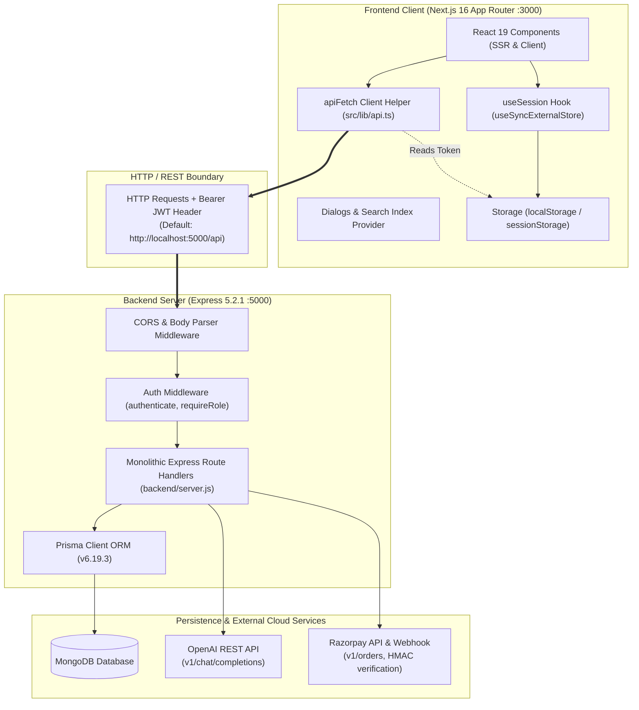

# 02 - Current Architecture: LUCOUS

## 1. Architectural Topology

The LUCOUS platform is currently organized as a **decoupled two-tier client-server application**:
1. **Frontend:** A standalone Next.js App Router project executing in Node.js / Browser.
2. **Backend:** A standalone Express.js REST API service executing in a separate Node.js process on port 5000, connecting to MongoDB via Prisma ORM.



---

## 2. Frontend Layer Details

### Component & Routing Hierarchy
- **Framework Conventions:** Uses Next.js 16 App Router with React Server Components as the default, marking interactive pages with `"use client"`.
- **Dynamic Role Dashboard Routing:** Located at [`src/app/(dashboard)/[role]/dashboard/page.tsx`](file:///c:/Shiva/Lucous2509-main/src/app/%28dashboard%29/%5Brole%5D/dashboard/page.tsx). It resolves `params: Promise<{ role: string }>` asynchronously (Next.js 15+ convention) and renders role-specific components:
  - `role === "student"` ➔ `<StudentHome />`
  - `role === "teacher"` ➔ `<TeacherHome />`
  - `role === "parent"` ➔ `<ParentHome />`
  - `role === "admin"` ➔ `<AdminHome />`
- **Sub-pages:** Child pages for student workflows (`/student/learn`, `/student/play`, `/student/practice`, `/student/test`, `/student/retest`, `/student/courses`, `/student/games`, `/student/tutor`, `/student/profile`, `/student/results`) are nested under `src/app/(dashboard)/student/`.
- **Public Website:** Rendered from [`src/app/page.tsx`](file:///c:/Shiva/Lucous2509-main/src/app/page.tsx) with 14 modular sections imported from [`src/components/site/sections/`](file:///c:/Shiva/Lucous2509-main/src/components/site/sections/).

### State & Session Management
- **Stateless Client Session Sync:** Implemented in [`src/lib/auth.ts`](file:///c:/Shiva/Lucous2509-main/src/lib/auth.ts) and [`src/lib/use-session.ts`](file:///c:/Shiva/Lucous2509-main/src/lib/use-session.ts).
- Uses React's `useSyncExternalStore` listening to `window.addEventListener("storage")` to synchronize auth credentials across browser tabs and prevent SSR hydration mismatch warnings.
- **Double Storage Pattern:**
  - Token and basic profile stored in `lucous_token` and `lucous_user`.
  - Frontend session state stored under `lucous.session`.
  - Stored in `localStorage` if "Remember Me" is checked; otherwise in `sessionStorage`.

### API Client
- Implemented in [`src/lib/api.ts`](file:///c:/Shiva/Lucous2509-main/src/lib/api.ts).
- `apiFetch<T>(path, options)` wraps native `fetch`. It:
  1. Retrieves the JWT token from `localStorage` or `sessionStorage`.
  2. Sets `Content-Type: application/json` and `Authorization: Bearer <token>`.
  3. Targets `http://localhost:5000/api` directly (hardcoded string).
  4. Parses JSON and verifies `payload.success === true`; throws `new Error(payload.message)` if false.

---

## 3. Backend Layer Details

### Single Monolithic Server (`backend/server.js`)
All backend API routes, middleware definitions, utility helpers, and third-party API clients are concentrated in a single 1,834-line file: [`backend/server.js`](file:///c:/Shiva/Lucous2509-main/backend/server.js).

### Middleware Pipeline
1. **CORS:** Configured with origins `http://localhost:3000` and `http://127.0.0.1:3000`, supporting `credentials: true`.
2. **Body Parser:** `express.json` with a custom `verify` function capturing `req.rawBody` for Razorpay HMAC-SHA256 signature verification.
3. **Authentication Middleware (`authenticate`):**
   - Extracts Bearer token from the `Authorization` header.
   - Verifies JWT using `process.env.JWT_SECRET` (fallback: `"lucous-development-secret"`).
   - Injects `req.userId` and `req.role` into the Express request object.
4. **Role Middleware:**
   - `requireRole(role)`: Validates that `req.role === role`.
   - `requireStudent`: Enforces `req.role === "STUDENT"`.
   - `requireTeacher`: Enforces `req.role === "TEACHER"`.

---

## 4. Database Access Layer

- **Engine:** Prisma ORM 6.19.3 configured with the MongoDB connector:
  ```prisma
  datasource db {
    provider = "mongodb"
    url      = env("MONGODB_URI")
  }
  ```
- **Query Mechanism:** Directly invokes `prisma.<model>.<action>` across route handlers in [`backend/server.js`](file:///c:/Shiva/Lucous2509-main/backend/server.js).
- **ID Representation:** MongoDB uses 12-byte / 24-character hex ObjectIds mapped to string fields:
  ```prisma
  id String @id @default(auto()) @map("_id") @db.ObjectId
  ```

---

## 5. External Services Integration

### OpenAI Integration
- **Implementation:** Custom wrapper function `callAi(messages, { json = false })` in [`backend/server.js`](file:///c:/Shiva/Lucous2509-main/backend/server.js#L1490).
- Makes an HTTPS POST to `https://api.openai.com/v1/chat/completions` using native Node `fetch`.
- Expects:
  - `process.env.AI_PROVIDER` (must be `"openai"`)
  - `process.env.AI_API_KEY`
  - `process.env.AI_MODEL` (defaults to `"gpt-4o-mini"`)
- Supports structured output when `json: true` via `response_format: { type: "json_object" }`.

### Razorpay Payments Integration
- **Configuration Check:** `razorpayConfigured()` checks presence of `RAZORPAY_KEY_ID` and `RAZORPAY_KEY_SECRET`.
- **Order Generation:** Directly posts to `https://api.razorpay.com/v1/orders` using HTTP Basic Authentication (`Buffer.from(id:secret).toString('base64')`).
- **Signature Verification:** Computes `crypto.createHmac("sha256", secret).update(orderId + "|" + paymentId).digest("hex")` and validates with timing-safe comparison (`crypto.timingSafeEqual`).
- **Webhook Listener:** Listens on `/api/payments/webhook` verifying `x-razorpay-signature` against `req.rawBody` and `process.env.RAZORPAY_WEBHOOK_SECRET`.

---

## 6. Architectural Weaknesses & Couplings

1. **Monolithic Backend File:**
   - 1,834 lines in [`backend/server.js`](file:///c:/Shiva/Lucous2509-main/backend/server.js) containing auth, student, teacher, admin, parent, games, AI, payments, and seed helpers.
   - Lacks modular controllers, route files, service layers, and dedicated validation schemas (e.g. Zod).
2. **Hardcoded API URL Across Frontend:**
   - `const API_URL = "http://localhost:5000/api";` is duplicated in 4 distinct files ([`api.ts`](file:///c:/Shiva/Lucous2509-main/src/lib/api.ts), [`login-form.tsx`](file:///c:/Shiva/Lucous2509-main/src/components/auth/login-form.tsx), [`signup-form.tsx`](file:///c:/Shiva/Lucous2509-main/src/components/auth/signup-form.tsx), [`forgot-password-form.tsx`](file:///c:/Shiva/Lucous2509-main/src/components/auth/forgot-password-form.tsx)).
   - No environment variable usage (`process.env.NEXT_PUBLIC_API_URL`).
3. **Data Type Drift Between Prisma and Frontend:**
   - Prisma MongoDB ObjectIds are strings, but [`src/lib/api.ts`](file:///c:/Shiva/Lucous2509-main/src/lib/api.ts) types `Board`, `Grade`, `Subject`, `Chapter`, `Topic`, `Question`, and `Attempt` IDs as `number`.
4. **Stateless JWT Without Revocation or Refresh:**
   - Tokens have a 7-day fixed expiration without refresh token rotation or database-backed session invalidation.
