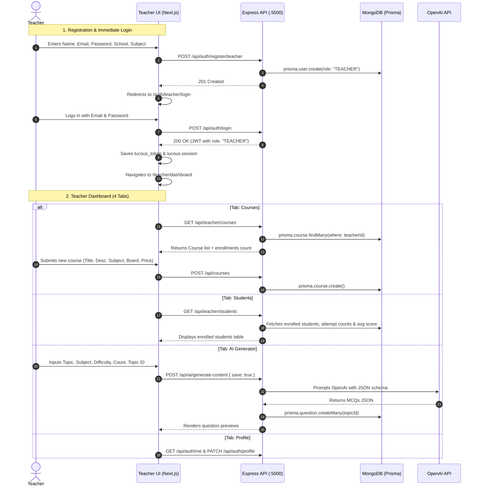

# 05 - Current Teacher Flow Audit: LUCOUS

## 1. Trace of the Current Teacher Flow

---

## 2. Comprehensive Requirement vs. Implementation Matrix

| Stakeholder Target Requirement | Current Codebase Implementation | Status | Evidence / File Path |
| :--- | :--- | :---: | :--- |
| **Teacher Signup** | Form collects Name, Email, Mobile, Password, School, Subject. Sends to backend. | 🟢 IMPLEMENTED | [`src/components/auth/signup-form.tsx:66`](file:///c:/Shiva/Lucous2509-main/src/components/auth/signup-form.tsx#L66) [`backend/server.js:128`](file:///c:/Shiva/Lucous2509-main/backend/server.js#L128) |
| **Pending Admin Approval State** | No pending screen. User is redirected directly to login page. | 🔴 NOT IMPLEMENTED | [`src/components/auth/signup-form.tsx:88`](file:///c:/Shiva/Lucous2509-main/src/components/auth/signup-form.tsx#L88) |
| **Admin Review of Teacher** | Admin can only view teachers in a general user list. No review modal or documents. | 🟡 PARTIALLY IMPLEMENTED | [`src/components/admin/admin-home.tsx:125`](file:///c:/Shiva/Lucous2509-main/src/components/admin/admin-home.tsx#L125) |
| **Admin Approval/Rejection Action** | No API endpoint and no buttons in the Admin dashboard exist to approve or reject. | 🔴 NOT IMPLEMENTED | [`backend/server.js:1254`](file:///c:/Shiva/Lucous2509-main/backend/server.js#L1254) |
| **Login Gated by Approval** | Login checks email/password only. Any teacher logs in immediately upon registration. | 🔴 NOT IMPLEMENTED | [`backend/server.js:132-191`](file:///c:/Shiva/Lucous2509-main/backend/server.js#L132) |
| **Teacher Dashboard** | Tabbed dashboard with Courses, Students, AI Generator, and Profile tabs. | 🟢 IMPLEMENTED | [`src/components/teacher/teacher-home.tsx:44`](file:///c:/Shiva/Lucous2509-main/src/components/teacher/teacher-home.tsx#L44) |
| **Create AI Lesson** | AI generator generates MCQs only. No textual lesson / curriculum explainer generator. | 🟡 PARTIALLY IMPLEMENTED | [`src/components/teacher/teacher-home.tsx:327`](file:///c:/Shiva/Lucous2509-main/src/components/teacher/teacher-home.tsx#L327) |
| **Add/Create Games** | Games are hardcoded system-wide (`GAMES`). Teachers cannot create or configure games. | 🔴 NOT IMPLEMENTED | [`src/lib/data.ts:84`](file:///c:/Shiva/Lucous2509-main/src/lib/data.ts#L84) [`backend/server.js:1377`](file:///c:/Shiva/Lucous2509-main/backend/server.js#L1377) |
| **Add/Create Tests & Quizzes** | Teacher can save AI-generated MCQs to a Topic. No manual quiz/test builder UI exists. | 🟡 PARTIALLY IMPLEMENTED | [`src/components/teacher/teacher-home.tsx:392`](file:///c:/Shiva/Lucous2509-main/src/components/teacher/teacher-home.tsx#L392) |
| **Publish Content** | Database models have `status: PUBLISHED`. Courses lack status. No UI publishing toggle. | 🟡 PARTIALLY IMPLEMENTED | [`backend/prisma/schema.prisma:123`](file:///c:/Shiva/Lucous2509-main/backend/prisma/schema.prisma#L123) |
| **Unpublish Content** | No UI toggle or endpoint to transition content from `PUBLISHED` to `DRAFT`. | 🔴 NOT IMPLEMENTED | [`backend/server.js:1017`](file:///c:/Shiva/Lucous2509-main/backend/server.js#L1017) |
| **Edit Published Content** | Teacher can edit Course title, description, subject, board, and price. Cannot edit lessons/questions from UI. | 🟡 PARTIALLY IMPLEMENTED | [`src/components/teacher/teacher-home.tsx:110`](file:///c:/Shiva/Lucous2509-main/src/components/teacher/teacher-home.tsx#L110) |
| **Manage Content / Curriculum** | Backend has `/api/teacher/content` (GET/POST), but no dashboard UI integrates it. | 🟡 PARTIALLY IMPLEMENTED | [`backend/server.js:936`](file:///c:/Shiva/Lucous2509-main/backend/server.js#L936) |
| **Generate Unique Code** | No unique code generation mechanism, model, or route exists for teachers. | 🔴 NOT IMPLEMENTED | Audited across `backend/server.js` and `schema.prisma`. |
| **Student Management** | Teacher can view table of enrolled students, total attempts, and average score. | 🟢 IMPLEMENTED | [`src/components/teacher/teacher-home.tsx:245`](file:///c:/Shiva/Lucous2509-main/src/components/teacher/teacher-home.tsx#L245) [`backend/server.js:1072`](file:///c:/Shiva/Lucous2509-main/backend/server.js#L1072) |
