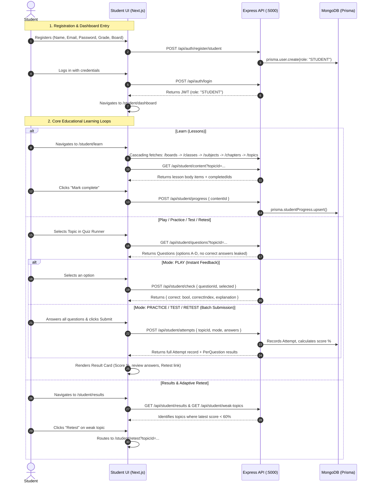

# 06 - Current Student Flow Audit: LUCOUS

## 1. Trace of the Current Student Flow

---

## 2. Requirement vs. Implementation Matrix

| Stakeholder Target Requirement | Current Codebase Implementation | Status | Evidence / File Path |
| :--- | :--- | :---: | :--- |
| **Student Signup & Login** | Implemented. Stores `lucous_token`, `lucous_user`, and `lucous.session`. | 🟢 IMPLEMENTED | [`src/components/auth/signup-form.tsx:29`](file:///c:/Shiva/Lucous2509-main/src/components/auth/signup-form.tsx#L29) [`src/components/auth/login-form.tsx:27`](file:///c:/Shiva/Lucous2509-main/src/components/auth/login-form.tsx#L27) |
| **Student Dashboard** | Displays welcome banner, progress bar, 8 quick-action tiles, weak topics, and recent attempts. | 🟢 IMPLEMENTED | [`src/components/student/student-home.tsx:52`](file:///c:/Shiva/Lucous2509-main/src/components/student/student-home.tsx#L52) |
| **Enter Unique Code** | No input field, modal, or API route exists for students to submit class/teacher codes. | 🔴 NOT IMPLEMENTED | Audited across `src/components/student/` and `src/app/(dashboard)/student/`. |
| **Access Assigned Content** | Students access open curriculum hierarchy only. No teacher assignment or locked access models. | 🟡 PARTIALLY IMPLEMENTED | [`src/components/student/topic-picker.tsx:23`](file:///c:/Shiva/Lucous2509-main/src/components/student/topic-picker.tsx#L23) |
| **Start AI Lesson** | Text lesson cards display curriculum content. AI Tutor chat is available. No guided interactive AI lesson flow. | 🟡 PARTIALLY IMPLEMENTED | [`src/components/student/learn-flow.tsx:16`](file:///c:/Shiva/Lucous2509-main/src/components/student/learn-flow.tsx#L16) [`src/components/student/tutor-view.tsx:21`](file:///c:/Shiva/Lucous2509-main/src/components/student/tutor-view.tsx#L21) |
| **Play Game** | Play mode (instant answer validation) and Arcade games (Quiz Battle, Speed Challenge) with XP scoring. | 🟢 IMPLEMENTED | [`src/components/student/quiz-runner.tsx:33`](file:///c:/Shiva/Lucous2509-main/src/components/student/quiz-runner.tsx#L33) [`src/components/student/games-view.tsx:29`](file:///c:/Shiva/Lucous2509-main/src/components/student/games-view.tsx#L29) |
| **Give Test / Quiz** | Practice (8 Qs) and Test (30 Qs) modes with multiple-choice questions fetched from database. | 🟢 IMPLEMENTED | [`src/components/student/quiz-runner.tsx:39-50`](file:///c:/Shiva/Lucous2509-main/src/components/student/quiz-runner.tsx#L39) |
| **Quiz Submission** | Submits answers array to backend. Evaluates score server-side and logs attempt. | 🟢 IMPLEMENTED | [`backend/server.js:685`](file:///c:/Shiva/Lucous2509-main/backend/server.js#L685) |
| **Instant Result** | Result screen displays score percentage, correct/total count, and per-question explanation review. | 🟢 IMPLEMENTED | [`src/components/student/quiz-runner.tsx:228-316`](file:///c:/Shiva/Lucous2509-main/src/components/student/quiz-runner.tsx#L228) |
| **Track Performance** | Performance stats aggregated across attempts: total attempts, total correct, average score %. | 🟢 IMPLEMENTED | [`src/components/student/results-view.tsx:66-74`](file:///c:/Shiva/Lucous2509-main/src/components/student/results-view.tsx#L66) |
| **Identify Weak Topics** | Backend queries attempts where `score < 60` and aggregates by topic. | 🟢 IMPLEMENTED | [`backend/server.js:778-831`](file:///c:/Shiva/Lucous2509-main/backend/server.js#L778) |
| **Adaptive Learning / Retest** | Direct Retest action loads the exact weak topic questions for focused score improvement. | 🟢 IMPLEMENTED | [`src/app/(dashboard)/student/retest/page.tsx:8`](file:///c:/Shiva/Lucous2509-main/src/app/%28dashboard%29/student/retest/page.tsx#L8) [`src/components/student/quiz-runner.tsx:51`](file:///c:/Shiva/Lucous2509-main/src/components/student/quiz-runner.tsx#L51) |
| **Parent Tracking** | Student attempts and progress are queryable by linked parent accounts. | 🟢 IMPLEMENTED | [`backend/server.js:1329-1372`](file:///c:/Shiva/Lucous2509-main/backend/server.js#L1329) |
