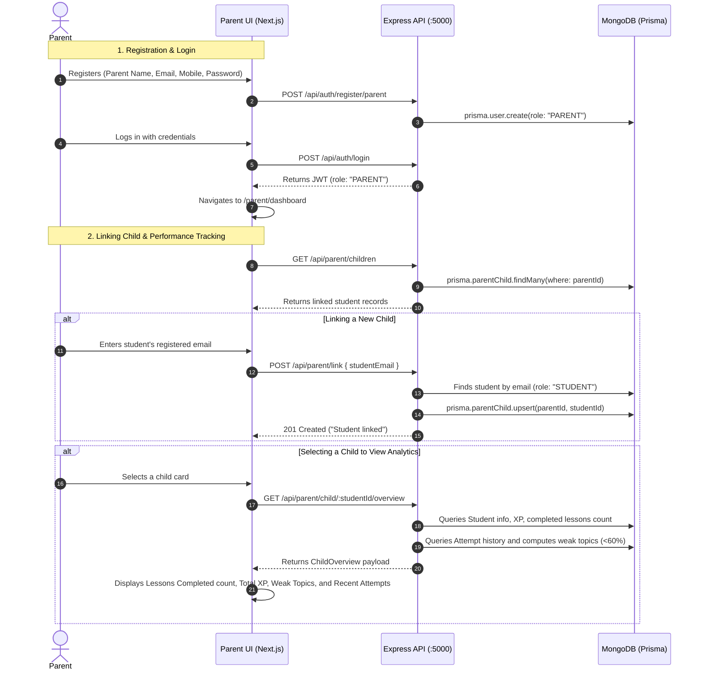

# 07 - Current Parent Flow Audit: LUCOUS

## 1. Trace of the Current Parent Flow

---

## 2. Requirement vs. Implementation Matrix

| Stakeholder Target Requirement | Current Codebase Implementation | Status | Evidence / File Path |
| :--- | :--- | :---: | :--- |
| **Parent Signup** | Form collects Parent name, Email, Mobile, Password. (Field `connectionCode` exists in form definition but is omitted by the submission handler). | 🟢 IMPLEMENTED | [`src/components/auth/signup-form.tsx:50-78`](file:///c:/Shiva/Lucous2509-main/src/components/auth/signup-form.tsx#L50) [`backend/server.js:129`](file:///c:/Shiva/Lucous2509-main/backend/server.js#L129) |
| **Parent Login** | Standard email & password login with `ROLE_MAP["parent"] === "PARENT"` validation. | 🟢 IMPLEMENTED | [`src/components/auth/login-form.tsx:53`](file:///c:/Shiva/Lucous2509-main/src/components/auth/login-form.tsx#L53) |
| **Parent Dashboard** | Clean workspace with tab navigation: "Children" and "Profile". | 🟢 IMPLEMENTED | [`src/components/parent/parent-home.tsx:26`](file:///c:/Shiva/Lucous2509-main/src/components/parent/parent-home.tsx#L26) |
| **Link Student Account** | Parent inputs student email. Backend verifies user exists with role `STUDENT` and creates `ParentChild` link record. | 🟢 IMPLEMENTED | [`src/components/parent/parent-home.tsx:90-103`](file:///c:/Shiva/Lucous2509-main/src/components/parent/parent-home.tsx#L90) [`backend/server.js:1294-1318`](file:///c:/Shiva/Lucous2509-main/backend/server.js#L1294) |
| **Child Selection & Switching** | Allows parent to select among multiple linked children, switching active overview. | 🟢 IMPLEMENTED | [`src/components/parent/parent-home.tsx:139-160`](file:///c:/Shiva/Lucous2509-main/src/components/parent/parent-home.tsx#L139) |
| **Track Learning Progress** | Overview card displays total count of completed lessons and accumulated gamification XP. | 🟢 IMPLEMENTED | [`src/components/parent/parent-home.tsx:192-198`](file:///c:/Shiva/Lucous2509-main/src/components/parent/parent-home.tsx#L192) [`backend/server.js:1340-1343`](file:///c:/Shiva/Lucous2509-main/backend/server.js#L1340) |
| **Track Test Results** | Renders list of recent test attempts showing Topic name, Chapter, Mode, Correct/Total, and Score %. | 🟢 IMPLEMENTED | [`src/components/parent/parent-home.tsx:223-239`](file:///c:/Shiva/Lucous2509-main/src/components/parent/parent-home.tsx#L223) |
| **Track Weak Topics** | Renders weak topics where child's score is < 60%, showing Topic name, Chapter name, and Score %. | 🟢 IMPLEMENTED | [`src/components/parent/parent-home.tsx:206-221`](file:///c:/Shiva/Lucous2509-main/src/components/parent/parent-home.tsx#L206) [`backend/server.js:1350-1364`](file:///c:/Shiva/Lucous2509-main/backend/server.js#L1350) |

---

## 3. Notable Observations & Edge Cases in Parent Flow

1. **Email-Only Linking:**
   - Linking requires knowing the child's exact registered email address.
   - The UI field `Student connection code` defined in [`src/lib/auth.ts:135`](file:///c:/Shiva/Lucous2509-main/src/lib/auth.ts#L135) is not wired into the backend linking logic.
2. **Access Control:**
   - The backend strictly enforces authorization: `GET /api/parent/child/:id/overview` verifies that a `ParentChild` record exists connecting `req.userId` and the requested student ID before returning data ([`backend/server.js:1332`](file:///c:/Shiva/Lucous2509-main/backend/server.js#L1332)).
