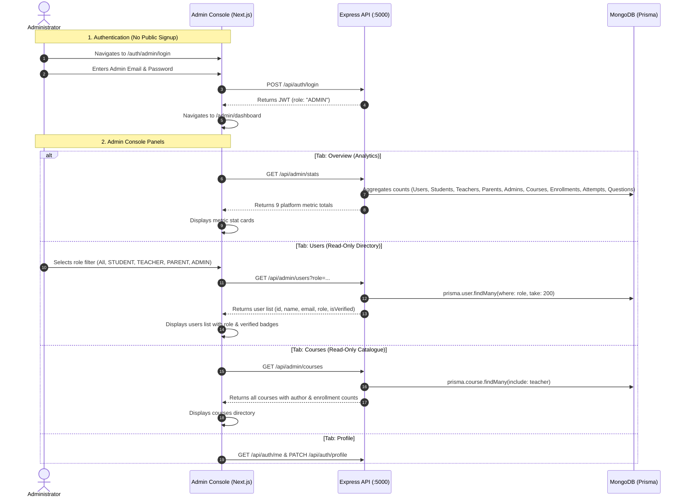

# 08 - Current Admin Flow Audit: LUCOUS

## 1. Trace of the Current Admin Flow

---

## 2. Requirement vs. Implementation Matrix

| Stakeholder Target Requirement | Current Codebase Implementation | Status | Evidence / File Path |
| :--- | :--- | :---: | :--- |
| **Admin Login** | Login form available. Signup is disabled by design (`allowsSignup: false`). Admin accounts must be pre-seeded in database. | 🟢 IMPLEMENTED | [`src/lib/auth.ts:55`](file:///c:/Shiva/Lucous2509-main/src/lib/auth.ts#L55) [`src/components/auth/login-form.tsx:24`](file:///c:/Shiva/Lucous2509-main/src/components/auth/login-form.tsx#L24) |
| **Admin Dashboard** | Console view with 4 tabs: Overview, Users, Courses, Profile. Protected by `RequireRole("admin")`. | 🟢 IMPLEMENTED | [`src/components/admin/admin-home.tsx:34`](file:///c:/Shiva/Lucous2509-main/src/components/admin/admin-home.tsx#L34) [`src/components/auth/require-role.tsx`](file:///c:/Shiva/Lucous2509-main/src/components/auth/require-role.tsx) |
| **Platform Analytics** | `GET /api/admin/stats` calculates 9 live metric counts from MongoDB using `prisma.<model>.count()`. | 🟢 IMPLEMENTED | [`src/components/admin/admin-home.tsx:73-123`](file:///c:/Shiva/Lucous2509-main/src/components/admin/admin-home.tsx#L73) [`backend/server.js:1230-1252`](file:///c:/Shiva/Lucous2509-main/backend/server.js#L1230) |
| **Review Teacher Accounts** | Admin can filter the user list by `TEACHER` and see name, email, and verification status. No detailed review modal or submitted documents. | 🟡 PARTIALLY IMPLEMENTED | [`src/components/admin/admin-home.tsx:125-192`](file:///c:/Shiva/Lucous2509-main/src/components/admin/admin-home.tsx#L125) [`backend/server.js:1254`](file:///c:/Shiva/Lucous2509-main/backend/server.js#L1254) |
| **Approve / Reject Teachers** | No approval/rejection endpoints exist in backend. No action buttons exist in the admin users list. | 🔴 NOT IMPLEMENTED | Audited across `backend/server.js` and `admin-home.tsx`. |
| **Manage Users (Edit/Ban/Delete)** | User list is completely read-only. No user edit, delete, password reset, or ban functions exist. | 🔴 NOT IMPLEMENTED | [`src/components/admin/admin-home.tsx:176-188`](file:///c:/Shiva/Lucous2509-main/src/components/admin/admin-home.tsx#L176) |
| **Manage Courses & Lessons** | Admin can view all platform courses (`GET /api/admin/courses`). Backend allows Admin to update course via `PUT /api/courses/:id`. No course delete/unpublish or lesson editing in UI. | 🟡 PARTIALLY IMPLEMENTED | [`src/components/admin/admin-home.tsx:194-247`](file:///c:/Shiva/Lucous2509-main/src/components/admin/admin-home.tsx#L194) [`backend/server.js:1023`](file:///c:/Shiva/Lucous2509-main/backend/server.js#L1023) |
