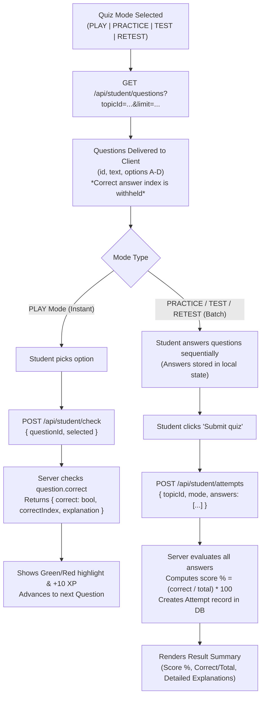

# 09 - Current Learning Flow: LUCOUS

## 1. Educational Content Hierarchy

All learning content in LUCOUS is structured around a strict 5-tier relational cascade stored in MongoDB:

```
Board (e.g. "CBSE")
  └── Grade (e.g. "Class 10")
        └── Subject (e.g. "Mathematics", "Science")
              └── Chapter (e.g. "Real Numbers", "Quadratic Equations")
                    └── Topic (e.g. "Euclid's Division Lemma")
                          ├── LearningContent (Reading cards, lessons)
                          ├── Question (MCQ test pool)
                          ├── Attempt (User quiz attempts & scores)
                          └── StudentProgress (Completed lesson records)
```

---

## 2. Topic Selection Cascade: `TopicPicker`

The component [`src/components/student/topic-picker.tsx`](file:///c:/Shiva/Lucous2509-main/src/components/student/topic-picker.tsx) drives topic selection across Learn, Practice, Test, and Game modes through a reactive cascade:
1. **Fetch Boards:** `GET /api/student/boards` ➔ Populates Board dropdown.
2. **Fetch Classes:** Triggered on Board change ➔ `GET /api/student/classes?boardId=...`.
3. **Fetch Subjects:** Triggered on Class change ➔ `GET /api/student/subjects?boardId=...&gradeId=...`.
4. **Fetch Chapters:** Triggered on Subject change ➔ `GET /api/student/chapters?subjectId=...`.
5. **Fetch Topics:** Triggered on Chapter change ➔ `GET /api/student/topics?chapterId=...`.
6. Once a topic is chosen, the parent component receives the full `Topic` object via `onSelect(topic)`.

---

## 3. Lesson Reading & Progress Tracking (`LearnFlow`)

Implemented in [`src/components/student/learn-flow.tsx`](file:///c:/Shiva/Lucous2509-main/src/components/student/learn-flow.tsx):
1. **Fetch Content:** Calls `GET /api/student/content?topicId=...`.
2. **Backend Execution ([`backend/server.js:604-622`](file:///c:/Shiva/Lucous2509-main/backend/server.js#L604)):**
   - Retrieves all `LearningContent` records where `status: "PUBLISHED"`, ordered by `order: "asc"`.
   - Cross-references `StudentProgress` for the current user to return an array of `completedIds`.
3. **Lesson Rendering:** Each lesson card displays title and markdown body.
4. **Mark as Complete:** Clicking "Mark complete" triggers `POST /api/student/progress { contentId }`, upserting a `StudentProgress` document. The UI immediately reflects completion with a green badge.

---

## 4. Assessment Engine: `QuizRunner`

The quiz engine in [`src/components/student/quiz-runner.tsx`](file:///c:/Shiva/Lucous2509-main/src/components/student/quiz-runner.tsx) powers all four assessment modes using a shared core:



### Assessment Modes Breakdown

| Mode | Question Limit | Evaluation Timing | XP Awarded | Intended Use Case |
| :--- | :---: | :---: | :---: | :--- |
| **PLAY** | 5 | Instant (Per-question) | +10 per correct answer | Quick gamified check with immediate explanation. |
| **PRACTICE** | 8 | Batch (On submit) | Standard score log | Low-stakes review of topic questions. |
| **TEST** | 30 | Batch (On submit) | Standard score log | Formal assessment simulating an exam. |
| **RETEST** | 30 | Batch (On submit) | Standard score log | Targeted retest launched from weak-topic recommendations. |

---

## 5. Weak Topic Detection & Adaptive Retest Loop

The system provides an automated adaptive learning loop ([`backend/server.js:778-831`](file:///c:/Shiva/Lucous2509-main/backend/server.js#L778)):
1. **Score Analysis:** When `GET /api/student/weak-topics` is called, the backend queries the student's attempt history.
2. **Identification Threshold:** It groups attempts by `topicId` and finds the **most recent attempt** for each topic. Any topic where the latest score is **strictly below 60%** is categorized as a "Weak Topic".
3. **Adaptive Trigger:**
   - In [`src/components/student/student-home.tsx`](file:///c:/Shiva/Lucous2509-main/src/components/student/student-home.tsx) and [`src/components/student/results-view.tsx`](file:///c:/Shiva/Lucous2509-main/src/components/student/results-view.tsx), weak topics are flagged with an urgent badge and a direct **"Retest"** link.
   - Retest routes directly to `/student/retest?topicId=<id>`, bypassing the 5-tier picker and immediately launching a targeted quiz on those weak concepts.
   - When the student scores ≥ 60% on the retest, the topic automatically drops off the weak topic list.
