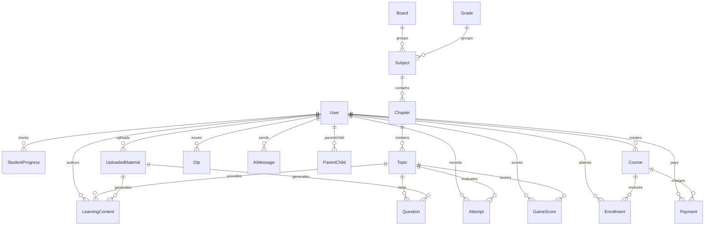

# 10 - Database Architecture: LUCOUS

## 1. Overview & Database Configuration

LUCOUS uses **MongoDB** as its primary persistent database, managed through **Prisma ORM 6.19.3** ([`backend/prisma/schema.prisma`](file:///c:/Shiva/Lucous2509-main/backend/prisma/schema.prisma)):

```prisma
generator client {
  provider = "prisma-client-js"
}

datasource db {
  provider = "mongodb"
  url      = env("MONGODB_URI")
}
```

Because MongoDB has no native enum types, categorical attributes (e.g., `role`, `status`, `mode`, `difficulty`) are stored as strings and validated at the Express application layer. All document IDs use 24-character hexadecimal MongoDB ObjectIds (`@db.ObjectId`).

---

## 2. Entity-Relationship Model



---

## 3. Comprehensive Model Inventory

### 1. `User`
- **Purpose:** Stores credentials, roles, and profile attributes for all four platform actors.
- **Fields:** `id` (ObjectId), `name` (String), `email` (String, unique), `password` (String, bcrypt hash), `role` (String, default "STUDENT"), `isVerified` (Boolean, default false), `phone`, `grade`, `board`, `school`, `subject`, `avatarUrl`, `xp` (Int, default 0), `createdAt`, `updatedAt`.
- **Relationships:** Relations to `Attempt`, `StudentProgress`, `UploadedMaterial`, `Course`, `Enrollment`, `Otp`, `GameScore`, `Payment`, `AiMessage`, and `ParentChild`.
- **Used by:** Authentication, Profiles, Admin user directory, Teacher student directory, Games leaderboard.
- **Critical Gap:** Has no `approvalStatus` (`PENDING`, `APPROVED`, `REJECTED`) for teachers.

### 2. `Otp`
- **Purpose:** One-time verification codes for email confirmation and password reset.
- **Fields:** `id` (ObjectId), `email` (String), `code` (String), `purpose` (String: "VERIFY" | "RESET"), `expiresAt` (DateTime), `verified` (Boolean), `createdAt`, `userId` (Optional ObjectId).
- **Indexes:** `@@index([email])`.
- **Used by:** Password reset and OTP verification routes.

### 3. `Board`
- **Purpose:** Highest curriculum tier (e.g., "CBSE", "ICSE", "State Board").
- **Fields:** `id` (ObjectId), `name` (String, unique).
- **Relationships:** `subjects Subject[]`.
- **Used by:** TopicPicker, Curriculum Seed.

### 4. `Grade`
- **Purpose:** Student class or academic standard (e.g., "Class 9", "Class 10").
- **Fields:** `id` (ObjectId), `name` (String, unique).
- **Relationships:** `subjects Subject[]`.
- **Used by:** TopicPicker, Curriculum Seed.

### 5. `Subject`
- **Purpose:** Academic subject within a Board and Grade (e.g., "Mathematics", "Science").
- **Fields:** `id` (ObjectId), `name` (String), `boardId` (ObjectId), `gradeId` (ObjectId).
- **Constraints:** `@@unique([boardId, gradeId, name])`.
- **Relationships:** Links to `Board`, `Grade`, `chapters Chapter[]`, `materials UploadedMaterial[]`.
- **Used by:** Curriculum hierarchy.

### 6. `Chapter`
- **Purpose:** Subject chapters (e.g., "Real Numbers", "Quadratic Equations").
- **Fields:** `id` (ObjectId), `subjectId` (ObjectId), `name` (String).
- **Constraints:** `@@unique([subjectId, name])`.
- **Relationships:** Links to `Subject`, `topics Topic[]`, `materials UploadedMaterial[]`.
- **Used by:** Curriculum hierarchy.

### 7. `Topic`
- **Purpose:** Individual conceptual topic where lessons and questions attach.
- **Fields:** `id` (ObjectId), `chapterId` (ObjectId), `name` (String).
- **Constraints:** `@@unique([chapterId, name])`.
- **Relationships:** Links to `Chapter`, `contents LearningContent[]`, `questions Question[]`, `attempts Attempt[]`, `materials UploadedMaterial[]`, `gameScores GameScore[]`.
- **Used by:** TopicPicker, LearnFlow, QuizRunner, GamesView.

### 8. `LearningContent`
- **Purpose:** Textual curriculum lessons and reading materials.
- **Fields:** `id` (ObjectId), `topicId` (ObjectId), `title` (String), `body` (String), `order` (Int), `source` (String: "TEACHER" | "UPLOADED" | "AI"), `status` (String: "DRAFT" | "PENDING_REVIEW" | "PUBLISHED"), `authorId` (ObjectId), `materialId` (ObjectId).
- **Relationships:** Links to `Topic`, `author User`, `material UploadedMaterial`, `progress StudentProgress[]`.
- **Used by:** LearnFlow, Curriculum Seed, Teacher Content API.

### 9. `Question`
- **Purpose:** Multiple-choice questions for assessments and games.
- **Fields:** `id` (ObjectId), `topicId` (ObjectId), `text` (String), `optionA`, `optionB`, `optionC`, `optionD` (String), `correct` (Int, 0-3 index), `explanation` (String), `difficulty` ("EASY" | "MEDIUM" | "HARD"), `source`, `status`, `materialId`.
- **Relationships:** Links to `Topic`, `material UploadedMaterial`.
- **Used by:** QuizRunner, GamesView, AI Question Generator.

### 10. `UploadedMaterial`
- **Purpose:** Teacher-uploaded syllabus documents, notes, or PDFs for AI processing.
- **Fields:** `id` (ObjectId), `teacherId` (ObjectId), `originalName`, `fileType`, `fileSize` (Int), `boardId`, `gradeId`, `subjectId`, `chapterId`, `topicId`, `status` ("UPLOADED" | "PROCESSING" | "ANALYZED" | "READY" | "FAILED"), `createdAt`.
- **Indexes:** `@@index([teacherId])`.
- **Used by:** Teacher Material Upload API (backend only).

### 11. `Attempt`
- **Purpose:** Persistent log of quiz, test, and retest submissions.
- **Fields:** `id` (ObjectId), `userId` (ObjectId), `topicId` (ObjectId), `mode` ("PLAY" | "PRACTICE" | "TEST" | "RETEST"), `correct` (Int), `total` (Int), `score` (Float), `createdAt`.
- **Indexes:** `@@index([userId])`.
- **Used by:** Quiz evaluation, ResultsView, Weak topic calculator, Parent overview.

### 12. `StudentProgress`
- **Purpose:** Records which lessons a student has marked as completed.
- **Fields:** `id` (ObjectId), `userId` (ObjectId), `contentId` (ObjectId), `completedAt`.
- **Constraints:** `@@unique([userId, contentId])`.
- **Used by:** LearnFlow, Student dashboard progress bar, Parent overview.

### 13. `Course`
- **Purpose:** Educational courses created by teachers for student purchase/enrollment.
- **Fields:** `id` (ObjectId), `title`, `description`, `subject`, `board`, `price` (Int, in paise), `currency` (String, default "INR"), `teacherId` (ObjectId), `createdAt`.
- **Indexes:** `@@index([teacherId])`.
- **Used by:** Teacher Courses panel, Student Course catalogue, Razorpay payment orders.
- **Critical Gap:** Has no `status` field (`DRAFT`, `PUBLISHED`, `UNPUBLISHED`).

### 14. `Enrollment`
- **Purpose:** Student registration in a course.
- **Fields:** `id` (ObjectId), `courseId` (ObjectId), `studentId` (ObjectId), `teacherId` (ObjectId), `status` (default "ENROLLED"), `createdAt`.
- **Constraints:** `@@unique([courseId, studentId])`, `@@index([studentId])`, `@@index([teacherId])`.
- **Used by:** Course enrollment, Student "My courses" tab, Teacher students list.

### 15. `Payment`
- **Purpose:** Audit record of financial transactions with Razorpay.
- **Fields:** `id` (ObjectId), `userId` (ObjectId), `courseId` (ObjectId), `amount` (Int, paise), `currency`, `status` ("CREATED" | "PAID" | "FAILED"), `razorpayOrderId` (unique), `razorpayPaymentId`, `razorpaySignature`, `createdAt`, `updatedAt`.
- **Indexes:** `@@index([userId])`.
- **Used by:** Razorpay order creation and webhook/verification handlers.

### 16. `GameScore`
- **Purpose:** Records arcade gameplay sessions and XP earned.
- **Fields:** `id` (ObjectId), `userId` (ObjectId), `gameId` (String), `topicId` (ObjectId), `correct` (Int), `total` (Int), `score` (Float), `xp` (Int), `createdAt`.
- **Indexes:** `@@index([userId])`, `@@index([gameId])`.
- **Used by:** GamesView arcade runner and stats panel.

### 17. `AiMessage`
- **Purpose:** Chat history for the student AI tutor.
- **Fields:** `id` (ObjectId), `userId` (ObjectId), `conversationId` (String), `role` ("user" | "assistant" | "system"), `content` (String), `createdAt`.
- **Indexes:** `@@index([userId])`, `@@index([conversationId])`.
- **Used by:** TutorView conversational chat.

### 18. `ParentChild`
- **Purpose:** Verified link connecting a parent account to a student account.
- **Fields:** `id` (ObjectId), `parentId` (ObjectId), `studentId` (ObjectId), `createdAt`.
- **Constraints:** `@@unique([parentId, studentId])`, `@@index([studentId])`.
- **Used by:** Parent linking, Parent children list, Parent child overview.
