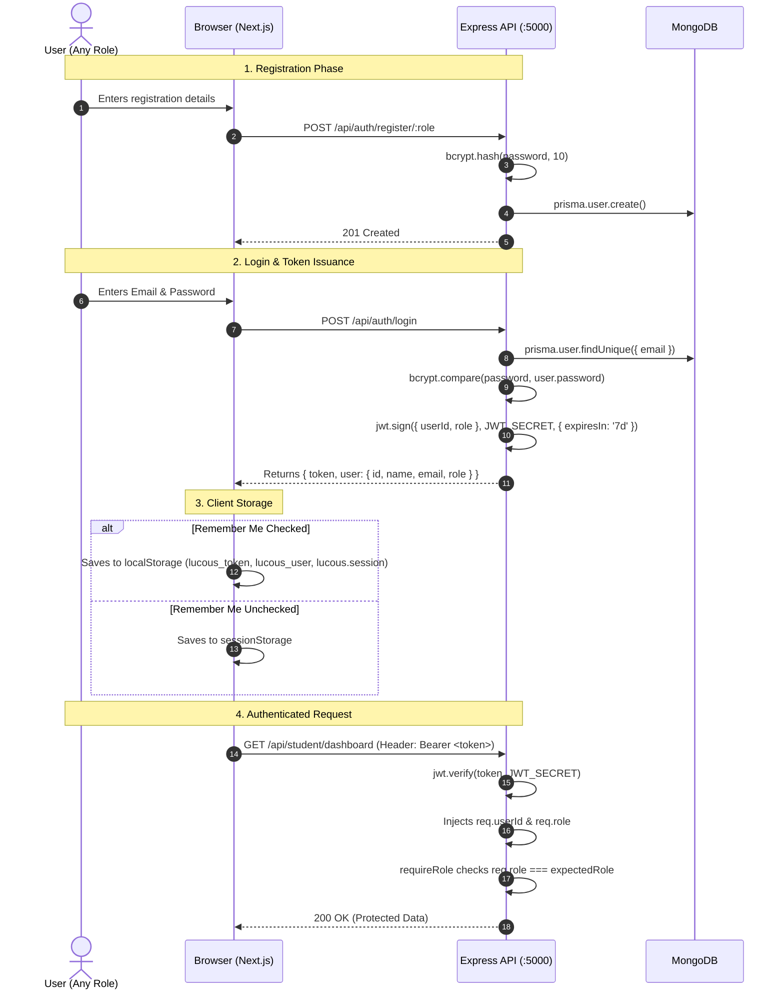

# 12 - Authentication and Authorization: LUCOUS

## 1. Authentication Lifecycle



---

## 2. Token Architecture & Storage

### Token Characteristics
- **Algorithm:** HMAC-SHA256 (default of `jsonwebtoken`).
- **Signature Secret:** Evaluated from `process.env.JWT_SECRET || "lucous-development-secret"`.
- **Expiration:** Fixed at 7 days (`7d`).
- **Payload Schema:**
  ```json
  {
    "userId": "65f1a2b3c4d5e6f7a8b9c0d1",
    "role": "STUDENT",
    "iat": 1774860000,
    "exp": 1775464800
  }
  ```

### Storage Mechanism & Synchronization
The frontend stores authentication credentials in three separate keys ([`src/lib/api.ts`](file:///c:/Shiva/Lucous2509-main/src/lib/api.ts#L8) and [`src/lib/auth.ts`](file:///c:/Shiva/Lucous2509-main/src/lib/auth.ts#L178)):
1. `lucous_token`: Raw JWT string used in HTTP headers.
2. `lucous_user`: Serialized JSON `{ id, name, email, role }` used for display tags.
3. `lucous.session`: Serialized JSON `{ role, email, name }` consumed by [`useSession()`](file:///c:/Shiva/Lucous2509-main/src/lib/use-session.ts) via `useSyncExternalStore`.

---

## 3. OTP & Password Reset Subsystem

The OTP subsystem is designed for development and testing without an external SMTP gateway ([`backend/server.js:255-407`](file:///c:/Shiva/Lucous2509-main/backend/server.js#L255)):
- **Code Generation:** Cryptographically random 6-digit number formatted via `crypto.randomInt(100000, 1000000)`.
- **TTL:** 10 minutes (`OTP_TTL_MS = 10 * 60 * 1000`).
- **Delivery Mechanism:**
  - In development (`NODE_ENV !== "production"`), the code is logged to `stdout` (`console.log`) **and** returned directly in the JSON response: `{ success: true, otp: "123456" }`.
  - In production, it would be dispatched via email (no email driver is currently implemented).
- **Verification:**
  - `POST /api/auth/verify-otp` matches email, code, and checks `expiresAt > now`. On success, marks `User.isVerified = true`.
- **Password Reset:**
  - `POST /api/auth/forgot-password` issues a reset OTP.
  - `POST /api/auth/reset-password` accepts email, OTP code, and new password. Updates password with a fresh `bcrypt.hash`.

---

## 4. Frontend Route Guards & Layout Handlers

1. **`RequireStudent` ([`src/components/student/require-student.tsx`](file:///c:/Shiva/Lucous2509-main/src/components/student/require-student.tsx)):**
   - Client-side shell around student routes.
   - Redirects to `/auth` if `session?.role !== "student"`.
   - Embeds the top application header and the sign-out trigger.
2. **`RequireRole` ([`src/components/auth/require-role.tsx`](file:///c:/Shiva/Lucous2509-main/src/components/auth/require-role.tsx)):**
   - Parameterized shell accepting `role: AuthRole`.
   - Used for `/teacher/dashboard`, `/parent/dashboard`, and `/admin/dashboard`.
   - Enforces `session?.role === role`, redirecting to `/auth` on mismatch.
3. **`RoleGate` ([`src/components/auth/role-gate.tsx`](file:///c:/Shiva/Lucous2509-main/src/components/auth/role-gate.tsx)):**
   - **Orphan Component:** Currently unused in any route. Replaced by `RequireRole`.

---

## 5. Security & Architectural Vulnerabilities

| Vulnerability / Risk | Severity | Description & Location |
| :--- | :---: | :--- |
| **Insecure Default Secret** | 🔴 HIGH | If `JWT_SECRET` is unset, server defaults to `"lucous-development-secret"` ([`backend/server.js:13`](file:///c:/Shiva/Lucous2509-main/backend/server.js#L13)). |
| **No Rate Limiting** | 🔴 HIGH | Zero rate limiting on `/api/auth/login`, `/send-otp`, or `/verify-otp`. Susceptible to brute force. |
| **Stateless Revocation Gap** | 🟡 MEDIUM | No JWT blacklist or refresh token rotation. Stolen tokens remain valid for the full 7-day period. |
| **Missing Teacher Approval Check** | 🔴 HIGH | Login accepts any valid teacher password without verifying administrative approval. |
| **Dev OTP Leaked if Env Misconfigured**| 🟡 MEDIUM | `isDev()` returns true whenever `NODE_ENV !== "production"`, returning the actual OTP in the JSON body. |
| **Client Storage Redundancy** | 🟢 LOW | Session stored under 3 separate keys (`lucous_token`, `lucous_user`, `lucous.session`) across local/sessionStorage. |
