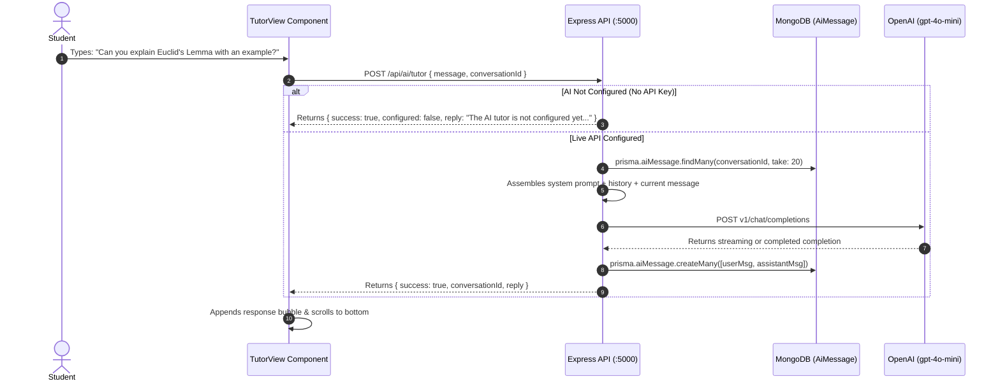

# 13 - AI System Architecture: LUCOUS

## 1. Overview & Current AI Infrastructure

The AI subsystem in LUCOUS consists of two server-side features powered by an **OpenAI API client** embedded directly in [`backend/server.js`](file:///c:/Shiva/Lucous2509-main/backend/server.js#L1490-L1518):
1. **Student AI Tutor:** A multi-turn conversational study assistant with chat memory.
2. **Teacher MCQ Generator:** Automated curriculum-aligned multiple-choice question generation with direct database persistence.

---

## 2. Configuration & Core Execution Engine (`callAi`)

The core function `callAi(messages, { json = false })` in [`backend/server.js:1490`](file:///c:/Shiva/Lucous2509-main/backend/server.js#L1490) communicates with OpenAI:

```javascript
async function callAi(messages, { json = false } = {}) {
  const provider = (process.env.AI_PROVIDER || "openai").toLowerCase();
  const apiKey = process.env.AI_API_KEY;
  const model = process.env.AI_MODEL || "gpt-4o-mini";

  if (!apiKey) return { ok: false, reason: "AI provider not configured" };
  if (provider !== "openai") {
    return { ok: false, reason: `Unsupported AI provider: ${provider}` };
  }

  const resp = await fetch("https://api.openai.com/v1/chat/completions", {
    method: "POST",
    headers: { "Content-Type": "application/json", Authorization: `Bearer ${apiKey}` },
    body: JSON.stringify({
      model,
      messages,
      ...(json ? { response_format: { type: "json_object" } } : {}),
    }),
  });
  // ... extracts and returns text
}
```

### Configuration Environment Variables
- `AI_PROVIDER`: String (Must evaluate to `"openai"`; any other value is rejected).
- `AI_API_KEY`: OpenAI Secret Key (`sk-...`).
- `AI_MODEL`: OpenAI Model identifier (Defaults to `"gpt-4o-mini"`).

---

## 3. Student AI Tutor Flow (`POST /api/ai/tutor`)

Implemented in [`backend/server.js:1522`](file:///c:/Shiva/Lucous2509-main/backend/server.js#L1522) and rendered in [`src/components/student/tutor-view.tsx`](file:///c:/Shiva/Lucous2509-main/src/components/student/tutor-view.tsx):



### System Prompt
```
"You are LUCOUS Tutor, a concise and encouraging tutor for school students. Explain concepts clearly and give short examples."
```

---

## 4. Teacher MCQ Content Generator (`POST /api/ai/generate-content`)

Implemented in [`backend/server.js:1578`](file:///c:/Shiva/Lucous2509-main/backend/server.js#L1578) and accessible from [`src/components/teacher/teacher-home.tsx:327`](file:///c:/Shiva/Lucous2509-main/src/components/teacher/teacher-home.tsx#L327):

1. **Parameters:**
   - `topic`: Required string.
   - `chapter`, `subject`: Optional curriculum context.
   - `difficulty`: `"EASY"` | `"MEDIUM"` | `"HARD"` (defaults to `"MEDIUM"`).
   - `count`: Clamped between 1 and 20 (defaults to 5).
   - `topicId`: Target Topic ObjectId string.
   - `save`: Boolean flag.
2. **Prompt Construction:**
   ```
   Generate {count} {difficulty} multiple-choice questions on the topic "{topic}" from chapter "{chapter}" for {subject}. Return JSON of the form {"questions":[{"text":"...","optionA":"...","optionB":"...","optionC":"...","optionD":"...","correct":0,"explanation":"..."}]} where correct is the 0-based index of the right option.
   ```
3. **Structured JSON Output:**
   - Passes `response_format: { type: "json_object" }`.
   - Parses response with `JSON.parse`.
4. **Database Persistence:**
   - If `save === true` and `topicId` is valid, bulk-inserts questions into MongoDB:
     ```javascript
     await prisma.question.createMany({
       data: questions.map(q => ({
         topicId, text: q.text, optionA: q.optionA, optionB: q.optionB,
         optionC: q.optionC, optionD: q.optionD, correct: q.correct,
         explanation: q.explanation, difficulty, source: "TEACHER", status: "PUBLISHED"
       }))
     });
     ```

---

## 5. Marketing vs. Reality Gap: The "AI Team"

The public landing page ([`src/components/site/sections/ai-team.tsx`](file:///c:/Shiva/Lucous2509-main/src/components/site/sections/ai-team.tsx)) highlights an **8-agent specialized AI team**:
- *Newton* (Physics/Math), *Curie* (Chemistry/Bio), *Socrates* (Logic), *Arya* (Coding), *Shakespeare* (Literature), *Ada* (Analytics), *Atlas* (Social Studies), *Coach* (Study Habits).

### Code Audit Reality
- There are **no distinct persona prompts** implemented in the backend.
- Both `/api/ai/tutor` and `/api/ai/generate-content` utilize a single, general-purpose system prompt.
- The 8 AI personas exist strictly as static marketing display objects in [`src/lib/data.ts:162-230`](file:///c:/Shiva/Lucous2509-main/src/lib/data.ts#L162).
- Neither persona selection, role conditioning, nor multi-agent delegation is implemented in backend code.
