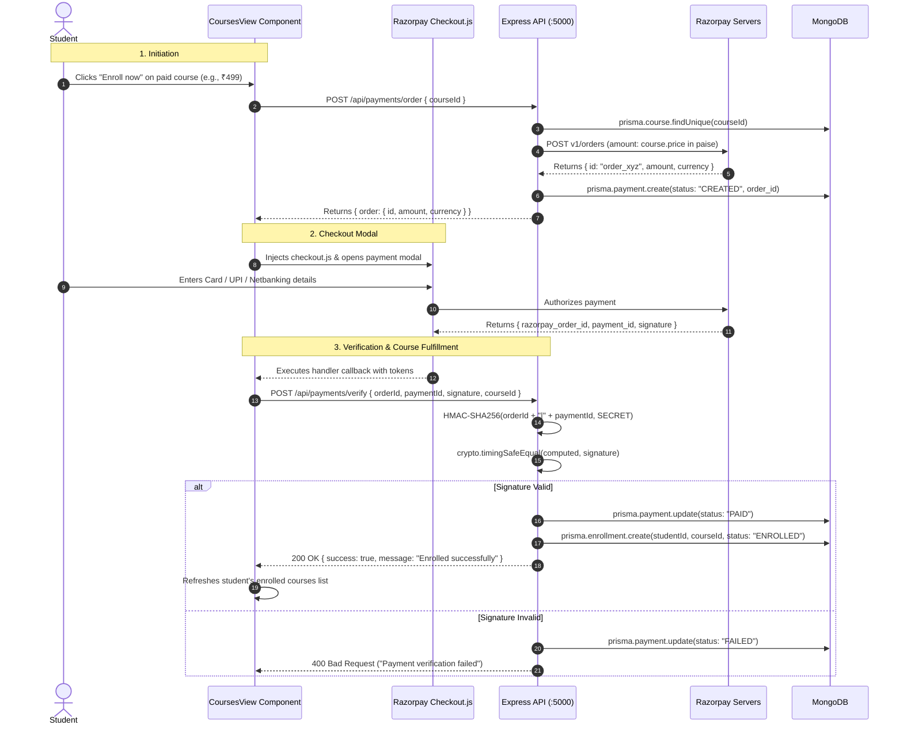

# 15 - Payment Gateway Subsystem: LUCOUS

## 1. Overview & Architecture

LUCOUS implements monetization through **Razorpay**, India's leading payment gateway. The payment pipeline handles paid course enrollments using server-side order generation and cryptographic signature verification.



---

## 2. Currency & Denomination Convention

- **Unit:** **Paise** (1 INR = 100 paise).
- Stored as integers in both `Course.price` and `Payment.amount`.
- A course priced at ₹499 is stored as `49900`.
- **Free Courses:** `Course.price === 0`. Students enroll directly via `POST /api/enrollments` without invoking the payment gateway.

---

## 3. Configuration & Credentials

The backend verifies credentials via `razorpayConfigured()` ([`backend/server.js:1652`](file:///c:/Shiva/Lucous2509-main/backend/server.js#L1652)):
- `RAZORPAY_KEY_ID`: Public key identifier (safe for frontend exposure).
- `RAZORPAY_KEY_SECRET`: Secret key used for HTTP Basic auth and HMAC computation.
- `RAZORPAY_WEBHOOK_SECRET`: Secret used to sign incoming webhook events.

### Public Config Route (`GET /api/payments/config`)
Returns `{ success: true, configured: boolean, keyId: string | null }`. Exposes only the public key to the browser. The secret key never leaves the backend.

---

## 4. Webhook Pipeline (`POST /api/payments/webhook`)

Implemented in [`backend/server.js:1789`](file:///c:/Shiva/Lucous2509-main/backend/server.js#L1789) to handle asynchronous payment confirmations:
1. **Raw Body Capture:** Enabled in [`backend/server.js:29-35`](file:///c:/Shiva/Lucous2509-main/backend/server.js#L29) by storing `req.rawBody = buf` in `express.json()`.
2. **Signature Verification:**
   ```javascript
   const expected = crypto
     .createHmac("sha256", secret)
     .update(req.rawBody)
     .digest("hex");
   if (!safeEqual(expected, signature)) {
     return res.status(400).json({ success: false, message: "Invalid webhook signature" });
   }
   ```
3. **Fulfillment:** On `order.paid` or `payment.captured`, finds the associated course and creates an `Enrollment` record if not already present.

---

## 5. Identified Gaps & Edge Cases

| Issue | Impact | Location |
| :--- | :--- | :--- |
| **Teacher UI Denomination Confusion** | In `TeacherHome`, price input is labelled `Price (paise, 0 = free)`. Teachers expecting to enter ₹500 enter `500`, resulting in a price of ₹5.00. | [`src/components/teacher/teacher-home.tsx:188`](file:///c:/Shiva/Lucous2509-main/src/components/teacher/teacher-home.tsx#L188) |
| **No Refund Pipeline** | No refund API endpoints or webhook event handlers (`payment.refunded`) exist. | `backend/server.js` |
| **No Tax / GST Computation** | Invoices, GST numbers, and tax itemization are not implemented. | `backend/server.js` |
