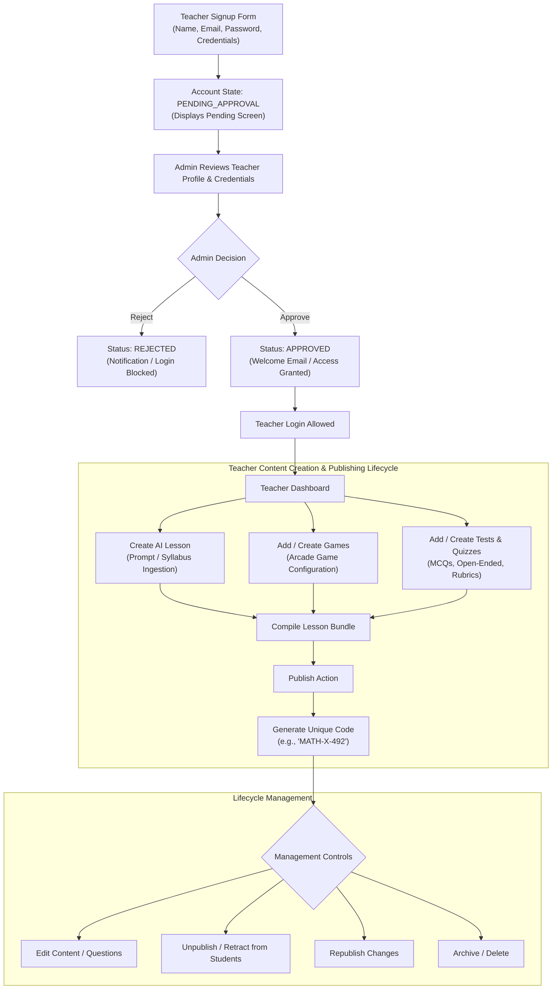
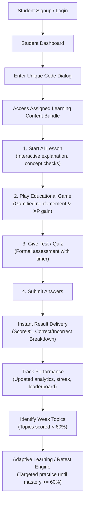
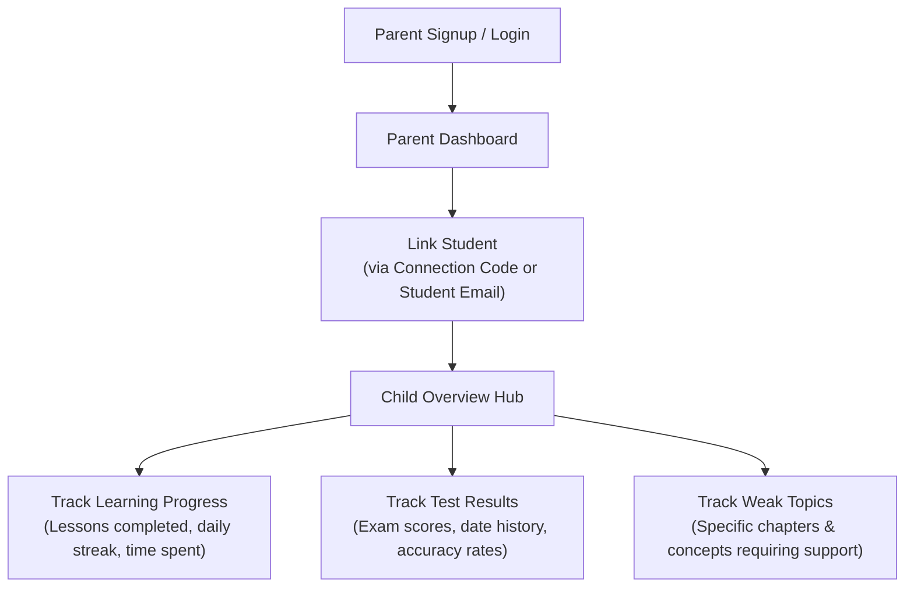
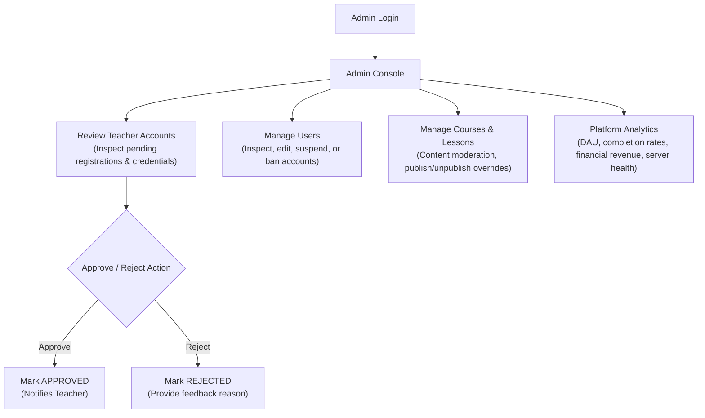

# 18 - Target Workflow Requirements

> ⚠️ **IMPORTANT NOTICE:**  
> **THIS DOCUMENT DESCRIBES TARGET STAKEHOLDER REQUIREMENTS — NOT CURRENT CODEBASE IMPLEMENTATION.**  
> None of the workflows detailed in this document should be assumed to be fully operational in the existing codebase without consulting the gap analysis in [`docs/17-CURRENT-ISSUES-AND-GAPS.md`](file:///c:/Shiva/Lucous2509-main/docs/17-CURRENT-ISSUES-AND-GAPS.md).

---

## 1. Teacher Target Workflow

### Acceptance Criteria for Teacher Workflow
1. **Approval Gate:** Newly signed-up teachers cannot obtain a JWT session or access `/teacher/dashboard` until an administrator marks their status as `APPROVED`.
2. **AI Lesson Creation:** Teachers can input curriculum parameters or notes to generate complete lesson units (explanatory texts, summaries, key formulas).
3. **Game & Quiz Authoring:** Teachers can attach specific questions to arcade game modes (Speed Challenge, Quiz Battle) and configure passing thresholds.
4. **Unique Code Generation:** Publishing an assignment or lesson package produces a distinct, shareable alphanumeric code.
5. **Full Lifecycle Controls:** Every published item must support:
   - **Publish:** Makes content discoverable to students who enter the code.
   - **Unpublish:** Hides content from active student view while preserving history.
   - **Edit:** Modifies questions, texts, or parameters with automatic versioning.
   - **Manage:** Monitors student completion rates, average scores, and individual student submissions.

---

## 2. Student Target Workflow

### Acceptance Criteria for Student Workflow
1. **Code Redemption:** Students can enter a teacher's unique code to enroll in a private class or unlock a custom curriculum bundle.
2. **Integrated 3-Step Sequence:** The bundle guides the student seamlessly through:
   - **Lesson:** Concept exploration.
   - **Game:** Fast-paced gamified retention check.
   - **Test:** Graded verification.
3. **Instant Evaluation:** Scores, XP increments, and answer rationales are rendered immediately upon test submission.
4. **Weak Topic Remediation:** The platform automatically highlights topics where the score was under 60% and suggests focused retests.

---

## 3. Parent Target Workflow

### Acceptance Criteria for Parent Workflow
1. **Secure Student Linking:** Links parent accounts to students with mutual confirmation (or teacher/student connection code).
2. **Transparent Progress Tracking:** Real-time visibility into lessons completed and active study streaks.
3. **Actionable Insights:** Direct identification of weak topics so parents know where their child requires additional tutoring or practice.

---

## 4. Admin Target Workflow

### Acceptance Criteria for Admin Workflow
1. **Teacher Queue:** Dedicated interface listing all `PENDING_APPROVAL` teacher accounts with one-click Approve and Reject actions.
2. **User Moderation:** Complete administrative control over all user accounts (role changes, verification resets, suspension).
3. **Content Oversight:** Ability to review, edit, unpublish, or delete any course, lesson, or question pool violating platform standards.
4. **Platform Analytics:** Deep-dive charts showing active users, test completion metrics, revenue volume, and error rates.
