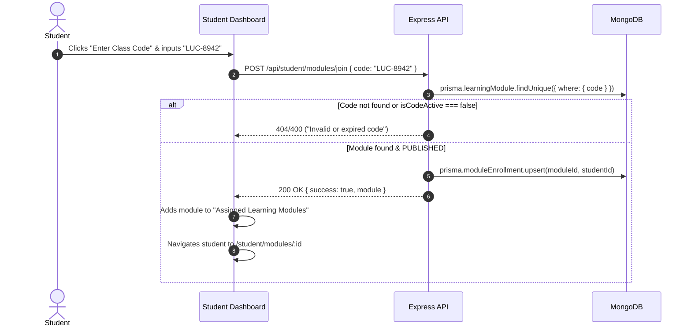
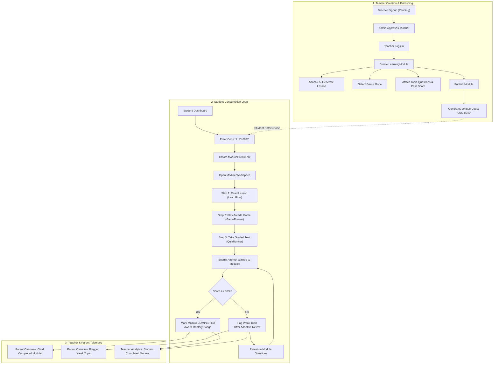

# 20 - Target Architecture Design: LUCOUS

> **Document Status:** PROPOSED ARCHITECTURAL BLUEPRINT (Zero Code Modifications)  
> **Purpose:** Formal architectural design addressing the 17 core questions to bridge the gap between the current codebase and the stakeholder target workflow (*Teacher ➔ Publish ➔ Unique Code ➔ Student Learning Loop*).

---

## 1. Executive Summary & Design Principles

The stakeholder workflow requires a unified, teacher-directed educational unit:
```
Teacher ➔ Create (AI Lesson + Game + Test) ➔ Publish ➔ Unique Code ➔ Student Redeems Code ➔ Learn + Play + Test ➔ Instant Result ➔ Adaptive Retest ➔ Parent Telemetry
```

### Guiding Principles:
1. **No Over-Engineering:** Build upon what already works. The 5-tier curriculum cascade (**Board → Grade → Subject → Chapter → Topic**), the multi-mode `QuizRunner`, the `LearnFlow`, and the parent overview aggregation are preserved completely.
2. **Clear Domain Boundaries:** Keep commercial `Course` (paid enrollments via Razorpay) separate from classroom `LearningModule` (free, teacher-assigned units unlocked by unique codes).
3. **Minimal Schema Delta:** Introduce only **2 new models** (`LearningModule`, `ModuleEnrollment`) and add only **2 non-breaking optional fields** to existing models (`User.approvalStatus` and `Attempt.moduleId`).

---

## 2. Core Architectural Questions Answered

### 1. What is the Central Learning Entity? (`Course` vs. `LearningModule`)
**Decision:** Introduce **`LearningModule`** as the dedicated central learning entity.

**Rationale:**
- In the current schema, `Course` is modeled specifically as a **monetized catalogue item** with `price` (in paise), `currency`, `payments`, and Razorpay order links.
- Classroom assignments are fundamentally different: they are teacher-directed, topic-focused, time-bound, free, and unlocked via class codes.
- Overloading `Course` would contaminate the payment and pricing logic with assignment codes and classroom statuses.
- A `LearningModule` represents one cohesive curriculum unit containing:
  - 1 AI/Teacher Lesson
  - 1 Gamified Retention Challenge
  - 1 Graded MCQ Assessment
  - 1 Unique Join Code
  - Publication lifecycle states (`DRAFT`, `PUBLISHED`, `ARCHIVED`)

---

### 2. How Should Teacher Ownership Work?
```
User (Role: TEACHER)
   │ (1)
   └── owns (N) ──> LearningModule
```
- Each `LearningModule` stores `teacherId String @db.ObjectId` with a foreign key relation to `User.id`.
- Express middleware verifies ownership: only the authoring teacher (or an `ADMIN`) can edit, publish, unpublish, or delete the module.
- Teacher Dashboard queries: `prisma.learningModule.findMany({ where: { teacherId: req.userId } })`.

---

### 3. How Should the AI Lesson Belong to the Module?
- A `LearningModule` references curriculum reading content via:
  ```prisma
  lessonContentId String? @db.ObjectId
  lessonContent   LearningContent? @relation(fields: [lessonContentId], references: [id])
  ```
- Alternatively, if the teacher writes custom lesson text or generates it with AI, a new `LearningContent` document is authored with `source: "AI"` or `"TEACHER"` and linked to this module.
- Reuses the existing `LearningContent` model and the [`LearnFlow`](file:///c:/Shiva/Lucous2509-main/src/components/student/learn-flow.tsx) UI component without duplicating lesson schemas.

---

### 4. How Should Games Belong to the Module?
- Instead of building a complex new game engine, `LearningModule` specifies which game mode reinforces the lesson:
  ```prisma
  gameMode        String @default("rapid-fire") // rapid-fire | topic-blitz | speed-challenge
  gameXpBonus     Int    @default(50)
  ```
- When the student enters the module's "Play" step, the client launches the existing `GameRunner` loaded with the module's question bank.
- Game submissions record `GameScore` linked to the module's topic and award gamification XP.

---

### 5. How Should Tests / Quizzes Belong to the Module?
- The module links to a pool of questions directly associated with the curriculum `Topic` or custom-generated by the teacher:
  ```prisma
  testTimeLimit   Int    @default(15) // minutes (0 = untimed)
  passScore       Float  @default(60.0) // % threshold for mastery
  allowRetest     Boolean @default(true)
  ```
- The assessment step runs in [`QuizRunner`](file:///c:/Shiva/Lucous2509-main/src/components/student/quiz-runner.tsx) under mode `TEST`.

---

### 6. Where Should the Unique Code Live?
- The unique code lives directly on the `LearningModule` model:
  ```prisma
  code            String  @unique // e.g. "LUC-8942" or "MATH-X-101"
  isCodeActive    Boolean @default(true)
  ```
- **Indexed:** `@unique` guarantees fast $O(1)$ lookups and prevents duplicate codes.
- **Generation:** Automatically generated as a clean 6-to-8 character uppercase alphanumeric string (e.g. `LUC-` + 4 hex characters) when the teacher creates or publishes the module.

---

### 7. How Does Student Redemption Work?


---

### 8. How Does Enrollment & Access Work?
- Implemented via a lean join entity: **`ModuleEnrollment`**:
  ```prisma
  model ModuleEnrollment {
    id          String         @id @default(auto()) @map("_id") @db.ObjectId
    moduleId    String         @db.ObjectId
    module      LearningModule @relation(fields: [moduleId], references: [id])
    studentId   String         @db.ObjectId
    student     User           @relation(fields: [studentId], references: [id])
    status      String         @default("ACTIVE") // ACTIVE | COMPLETED
    joinedAt    DateTime       @default(now())
    completedAt DateTime?

    @@unique([moduleId, studentId])
    @@index([studentId])
    @@index([moduleId])
  }
  ```
- Guarantees that entering the code multiple times is idempotent.
- Allows students to see all active assignments in an "Assigned by Teachers" shelf on their dashboard.

---

### 9. How Do Attempts Connect Back to the Module?
- Add one optional foreign key to the existing `Attempt` model:
  ```prisma
  moduleId String?         @db.ObjectId
  module   LearningModule? @relation(fields: [moduleId], references: [id])
  ```
- **Open Curriculum Attempts:** `moduleId` is `null`.
- **Module Attempts:** `moduleId` stores the target module ID.
- Enables teachers to query aggregated analytics:
  ```javascript
  const attempts = await prisma.attempt.findMany({
    where: { moduleId: module.id },
    include: { user: { select: { name: true, email: true } } }
  });
  ```

---

### 10. How Do Weak Topics Connect to Adaptive Retesting?
- If a student scores `< passScore` (default 60%) on the module test:
  1. The module's topic is marked as a **Weak Topic** on the student dashboard.
  2. The student's result screen displays: *"Score below 60% — Retest recommended"*.
  3. A direct **"Retest Module"** button launches `QuizRunner` in `mode="RETEST"`, recording a new attempt linked to `moduleId`.
  4. Scoring ≥ 60% updates `ModuleEnrollment.status = "COMPLETED"`, clearing the weak topic flag.

---

### 11. How Does Parent Tracking Obtain Module Progress?
- The existing route `GET /api/parent/child/:id/overview` is extended to include assigned modules:
  ```javascript
  const modules = await prisma.moduleEnrollment.findMany({
    where: { studentId: childId },
    include: {
      module: {
        select: { title: true, subject: true, teacher: { select: { name: true } } }
      }
    }
  });
  ```
- The Parent Dashboard displays a new card: **"Assigned School Modules"** showing teacher name, module title, completion status, and test scores.

---

### 12. What Happens When a Teacher Unpublishes?
1. Teacher switches status from `PUBLISHED` to `DRAFT` (or `ARCHIVED`).
2. `isCodeActive` is set to `false`.
3. New students entering the code receive an error: *"This module has been closed by the teacher."*
4. For already-enrolled students:
   - Module status displays as *"Closed"*.
   - Historical test attempts, score cards, and XP remain intact in read-only mode.

---

### 13. What Happens When a Teacher Edits?
- **Metadata/Lesson Edits:** Modifications to title, description, or lesson text update immediately in MongoDB and reflect on next student load.
- **Question Pool Edits:** Past `Attempt` records preserve their own historical scores and `perQuestion` snapshot; subsequent student quiz runs pull the updated question set.

---

### 14. What Does Admin Approval Actually Control?
- Adds `approvalStatus` to the `User` model:
  ```prisma
  approvalStatus String @default("APPROVED") // PENDING | APPROVED | REJECTED
  ```
  - For `STUDENT`, `PARENT`, and `ADMIN`: Defaults to `"APPROVED"`.
  - For `TEACHER`: Defaults to `"PENDING"`.
- **Backend Gate (`/api/auth/login`):**
  ```javascript
  if (user.role === "TEACHER" && user.approvalStatus !== "APPROVED") {
    return res.status(403).json({
      success: false,
      message: "Your teacher account is pending administrative approval."
    });
  }
  ```
- **Admin Console:** Adds "Approve" and "Reject" buttons in `AdminHome` calling `POST /api/admin/teachers/:id/approve`.

---

## 3. Comprehensive Schema Delta Analysis

### Existing Models Reused As-Is:
1. `Board`, `Grade`, `Subject`, `Chapter`, `Topic` — 100% preserved.
2. `LearningContent` — Reused for reading lessons.
3. `Question` — Reused for assessment pools.
4. `StudentProgress` — Reused for lesson completion tracking.
5. `GameScore` — Reused for arcade XP.
6. `AiMessage` — Reused for AI tutor chat.
7. `ParentChild` — Reused for parent linking.
8. `Course`, `Enrollment`, `Payment` — Preserved for commercial courses.

### Existing Models Requiring Minor Additive Fields:
1. **`User`:**
   ```prisma
   approvalStatus String    @default("APPROVED") // PENDING | APPROVED | REJECTED
   approvedAt     DateTime?
   approvedById   String?   @db.ObjectId
   ```
2. **`Attempt`:**
   ```prisma
   moduleId       String?   @db.ObjectId
   module         LearningModule? @relation(fields: [moduleId], references: [id])
   ```

### Genuinely Necessary New Models (Only 2):
```prisma
model LearningModule {
  id              String            @id @default(auto()) @map("_id") @db.ObjectId
  title           String
  description     String?
  code            String            @unique
  isCodeActive    Boolean           @default(true)
  status          String            @default("DRAFT") // DRAFT | PUBLISHED | ARCHIVED
  
  // Ownership
  teacherId       String            @db.ObjectId
  teacher         User              @relation(fields: [teacherId], references: [id])
  
  // Curriculum Reference (Connects to existing cascade)
  boardId         String?           @db.ObjectId
  gradeId         String?           @db.ObjectId
  subjectId       String?           @db.ObjectId
  chapterId       String?           @db.ObjectId
  topicId         String?           @db.ObjectId
  topic           Topic?            @relation(fields: [topicId], references: [id])
  
  // Content Components
  lessonContentId String?           @db.ObjectId
  lessonContent   LearningContent?  @relation(fields: [lessonContentId], references: [id])
  gameMode        String            @default("rapid-fire")
  testTimeLimit   Int               @default(15) // minutes
  passScore       Float             @default(60.0) // %
  allowRetest     Boolean           @default(true)

  createdAt       DateTime          @default(now())
  updatedAt       DateTime          @updatedAt

  enrollments     ModuleEnrollment[]
  attempts        Attempt[]

  @@index([teacherId])
  @@index([code])
}

model ModuleEnrollment {
  id              String            @id @default(auto()) @map("_id") @db.ObjectId
  moduleId        String            @db.ObjectId
  module          LearningModule    @relation(fields: [moduleId], references: [id])
  studentId       String            @db.ObjectId
  student         User              @relation(fields: [studentId], references: [id])
  status          String            @default("ACTIVE") // ACTIVE | COMPLETED
  joinedAt        DateTime          @default(now())
  completedAt     DateTime?

  @@unique([moduleId, studentId])
  @@index([studentId])
  @@index([moduleId])
}
```

---

## 4. End-to-End Workflow Architecture Diagram


