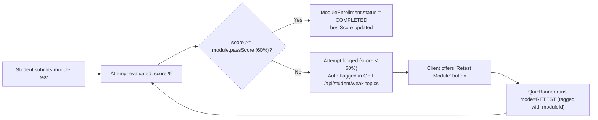
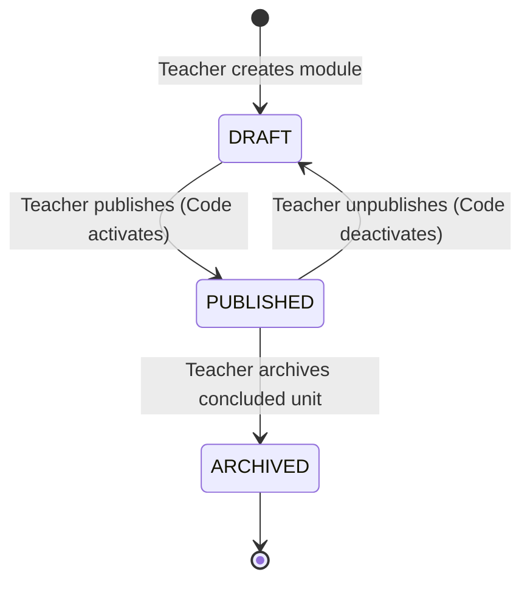
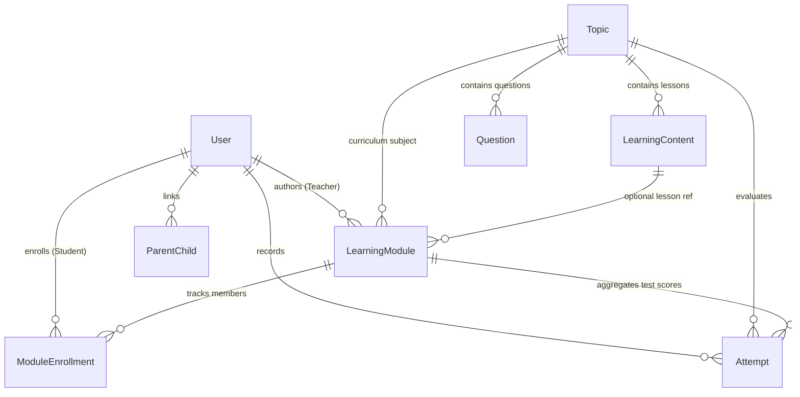

# 21 - Target Database Architecture Design: LUCOUS

> **Document Status:** ARCHITECTURAL DESIGN SPECIFICATION ONLY  
> **Phase:** Phase 2 — Target Database Architecture  
> **Rule Enforcement:** Zero code or schema modifications have been applied. No database migrations, package installations, or script executions have occurred. This document serves as the formal design blueprint for future database implementation.

---

## 1. Executive Summary

This document specifies the exact, minimal database architecture required to implement the stakeholder target workflow:
```text
Teacher Signup ➔ PENDING ➔ Admin Approval ➔ Teacher Dashboard ➔ Create LearningModule 
  (AI Lesson + Game + Test) ➔ Publish ➔ Unique Code ➔ Student Enters Code ➔ ModuleEnrollment 
  ➔ Learn ➔ Play ➔ Test ➔ Instant Result ➔ Weak Topic ➔ Adaptive Retest ➔ Completion ➔ Parent Telemetry
```

### Key Architectural Decisions:
1. **Preserve the Curriculum Cascade:** The 5-level hierarchy (**Board → Grade → Subject → Chapter → Topic**) remains 100% untouched.
2. **Minimal Schema Delta:** Introduces only **two new models** (`LearningModule`, `ModuleEnrollment`) and adds only **four non-breaking optional fields** across two existing models (`User.approvalStatus`, `User.approvedAt`, `User.approvedById`, `Attempt.moduleId`).
3. **No Over-Engineering:** Reuses `LearningContent` for lessons, reuses `Question` for tests, reuses `Attempt` for assessment tracking, reuses `ParentChild` for parent monitoring, and reuses application-level game modes without creating redundant tables.

---

## 2. Database Design Principles

The database design strictly adheres to five core principles:
1. **Minimum Necessary Database Change:** Never introduce a model or relation that can be handled through existing primitives or scalar fields.
2. **Backwards Compatibility:** Existing records in MongoDB (`User`, `Attempt`, `Course`, `Topic`, etc.) must remain completely valid without requiring data migrations or downtime.
3. **Domain Separation:** Commercial course commerce (`Course`, `Enrollment`, `Payment`) is kept isolated from classroom instructional modules (`LearningModule`, `ModuleEnrollment`).
4. **MongoDB & Prisma Optimization:** Leverage MongoDB native capabilities (such as scalar arrays for question ID lists and embedded ObjectId references) rather than unnecessary relational join tables.
5. **Referential Integrity & Query Velocity:** Index every foreign key and unique lookup field (`teacherId`, `code`, `studentId`, `moduleId`) to guarantee sub-millisecond query execution.

---

## 3. Existing Database Assessment

Below is the exhaustive audit of all 16 models currently in [`backend/prisma/schema.prisma`](file:///c:/Shiva/Lucous2509-main/backend/prisma/schema.prisma):

| Model | Current Purpose | Relationships | Action in Target Design | Justification |
| :--- | :--- | :--- | :---: | :--- |
| **`User`** | Stores credentials, profile data, roles, and XP. | `attempts`, `courses`, `enrollments`, `gameScores`, `children` | **MODIFY** | Add `approvalStatus`, `approvedAt`, `approvedById` to support the teacher approval gate. |
| **`Board`** | Highest curriculum tier (e.g. CBSE). | `subjects Subject[]` | **UNTOUCHED** | Core cascade is functioning properly. |
| **`Grade`** | Academic class/standard (e.g. Class 10). | `subjects Subject[]` | **UNTOUCHED** | Core cascade is functioning properly. |
| **`Subject`** | Academic subject within board/grade. | `Board`, `Grade`, `chapters` | **UNTOUCHED** | Core cascade is functioning properly. |
| **`Chapter`** | Subject chapter (e.g. Real Numbers). | `Subject`, `topics` | **UNTOUCHED** | Core cascade is functioning properly. |
| **`Topic`** | Conceptual topic (e.g. Euclid's Lemma). | `Chapter`, `contents`, `questions`, `attempts` | **UNTOUCHED** | Target for module curriculum attachment. |
| **`LearningContent`**| Explanatory reading lessons. | `Topic`, `author User`, `progress` | **UNTOUCHED** | Reused for module lesson texts. |
| **`Question`** | Multiple-choice questions. | `Topic`, `material` | **UNTOUCHED** | Reused for module assessments and games. |
| **`Attempt`** | Quiz and test scoring logs. | `User`, `Topic` | **MODIFY** | Add optional `moduleId` to connect test attempts to assignments. |
| **`StudentProgress`**| Global lesson completion flags. | `User`, `LearningContent` | **UNTOUCHED** | Preserved for global curriculum reading credit. |
| **`GameScore`** | Arcade gameplay scores and XP logs. | `User`, `Topic` | **UNTOUCHED** | Reused for module game scoring. |
| **`AiMessage`** | AI tutor conversation logs. | `User` | **UNTOUCHED** | AI tutor functions independently. |
| **`ParentChild`** | Verified parent-student links. | `parent User`, `student User` | **UNTOUCHED** | Reused to provide parent module telemetry. |
| **`Course`** | Commercial marketplace courses. | `teacher User`, `enrollments`, `payments` | **UNTOUCHED** | Preserved for paid course commerce. |
| **`Enrollment`** | Commercial course enrollments. | `Course`, `student User` | **UNTOUCHED** | Preserved for paid course commerce. |
| **`Payment`** | Razorpay payment audits. | `User`, `Course` | **UNTOUCHED** | Preserved for financial auditing. |

---

## 4. Proposed `LearningModule` Model Design

The `LearningModule` represents a cohesive, teacher-created instructional unit containing 1 Lesson + 1 Game + 1 Assessment + 1 Unique Code.

### Field Specification Table

| Field | Type | Required? | Default | Purpose / Justification |
| :--- | :--- | :---: | :---: | :--- |
| `id` | `String` | Yes | `auto() @map("_id") @db.ObjectId` | MongoDB primary key. |
| `title` | `String` | Yes | *None* | Human-readable title (e.g., *"Mastering Quadratic Equations"*). |
| `description` | `String?` | No | `null` | Teacher instructions or overview for students. |
| `code` | `String` | Yes | *None* (`@unique`) | Unique 6–8 character uppercase join code (e.g., `"LUC-8942"`). |
| `isCodeActive` | `Boolean` | Yes | `true` | Allows teachers to open/close student code redemption. |
| `status` | `String` | Yes | `"DRAFT"` | Lifecycle state: `"DRAFT"`, `"PUBLISHED"`, `"ARCHIVED"`. |
| `teacherId` | `String` | Yes | `@db.ObjectId` | Foreign key referencing the authoring teacher in `User`. |
| `topicId` | `String` | Yes | `@db.ObjectId` | Foreign key linking directly to the existing curriculum `Topic`. |
| `lessonContentId`| `String?` | No | `null` (`@db.ObjectId`) | Reference to a specific `LearningContent` lesson document. |
| `gameMode` | `String` | Yes | `"rapid-fire"` | Arcade reinforcement mode (`"rapid-fire"`, `"topic-blitz"`, `"speed-challenge"`). |
| `testTimeLimit` | `Int` | Yes | `15` | Assessment time limit in minutes (0 = untimed). |
| `passScore` | `Float` | Yes | `60.0` | Percentage score required to achieve module mastery. |
| `allowRetest` | `Boolean` | Yes | `true` | Whether students scoring < `passScore` can retake the test. |
| `customQuestionIds` | `String[]` | Yes | `[]` | Optional scalar list of specific `Question` ObjectIds chosen by the teacher. |
| `createdAt` | `DateTime` | Yes | `now()` | Audit timestamp. |
| `updatedAt` | `DateTime` | Yes | `@updatedAt` | Audit timestamp. |

### Relations:
- `teacher User @relation(fields: [teacherId], references: [id])`
- `topic Topic @relation(fields: [topicId], references: [id])`
- `lessonContent LearningContent? @relation(fields: [lessonContentId], references: [id])`
- `enrollments ModuleEnrollment[]`
- `attempts Attempt[]`

---

## 5. Proposed `ModuleEnrollment` Model Design

`ModuleEnrollment` represents a student's active registration in a teacher's module upon entering the unique code.

### Field Specification Table

| Field | Type | Required? | Default | Purpose / Justification |
| :--- | :--- | :---: | :---: | :--- |
| `id` | `String` | Yes | `auto() @map("_id") @db.ObjectId` | MongoDB primary key. |
| `moduleId` | `String` | Yes | `@db.ObjectId` | Foreign key referencing `LearningModule`. |
| `studentId` | `String` | Yes | `@db.ObjectId` | Foreign key referencing `User`. |
| `status` | `String` | Yes | `"ACTIVE"` | Status: `"ACTIVE"` (in progress), `"COMPLETED"` (passed test). |
| `lessonCompleted`| `Boolean` | Yes | `false` | True when student completes the module lesson step. |
| `gameCompleted` | `Boolean` | Yes | `false` | True when student completes the module game step. |
| `testCompleted` | `Boolean` | Yes | `false` | True when student submits the module test step. |
| `bestScore` | `Float?` | No | `null` | Student's highest percentage score on the module test. |
| `joinedAt` | `DateTime` | Yes | `now()` | Timestamp when student entered the code. |
| `completedAt` | `DateTime?` | No | `null` | Timestamp when student passed the test (score ≥ `passScore`). |

### Constraints & Indexes:
- `@@unique([moduleId, studentId])` — Prevents duplicate enrollments; entering the code again is idempotent.
- `@@index([studentId])` — Fast lookup for student dashboard: *"My Assigned Modules"*.
- `@@index([moduleId])` — Fast lookup for teacher dashboard: *"Enrolled Students for this Module"*.

---

## 6. User Model Modifications (Teacher Approval)

To support the gate `Teacher Signup ➔ PENDING ➔ Admin Approval ➔ Teacher Login`, the `User` model receives three non-breaking fields:

```prisma
model User {
  // ... existing fields untouched ...
  
  approvalStatus String    @default("APPROVED") // PENDING | APPROVED | REJECTED
  approvedAt     DateTime?
  approvedById   String?   @db.ObjectId
  
  // New opposite relations
  authoredModules LearningModule[]
  moduleEnrollments ModuleEnrollment[]
}
```

### Lifecycle Rules:
1. **Students, Parents, Admins:** Upon registration, `approvalStatus` is set to `"APPROVED"`.
2. **Teachers:** Upon registration, `approvalStatus` is explicitly saved as `"PENDING"`.
3. **Existing Users:** Existing users in MongoDB receive the schema default `"APPROVED"`, preventing lockout.
4. **Admin Approval:** When admin clicks "Approve", backend updates `approvalStatus: "APPROVED"`, `approvedAt: now()`, `approvedById: adminUserId`.

---

## 7. Attempt Model Modifications

To connect test and quiz attempts back to the assigned module, `Attempt` receives one optional foreign key:

```prisma
model Attempt {
  // ... existing fields untouched ...
  
  moduleId String?         @db.ObjectId
  module   LearningModule? @relation(fields: [moduleId], references: [id])
}
```

### Query Behavior:
- **Open Curriculum Quiz:** `moduleId` is `null`.
- **Module Assignment Test:** `moduleId` is populated with the `LearningModule.id`.
- Allows instant teacher telemetry: `prisma.attempt.findMany({ where: { moduleId } })`.

---

## 8. Lesson Content Relationship Architecture

```text
LearningModule (topicId) ──> lessonContentId? ──> LearningContent
```

### Decision & Analysis:
- **Reuse Existing Model:** We do **not** create a new `Lesson` table. The existing `LearningContent` model already provides `title`, `body`, `order`, `source` (`"TEACHER" | "AI"`), and `authorId`.
- **Flexibility:**
  - If a teacher selects an existing syllabus lesson, `lessonContentId` references that record.
  - If a teacher uses the AI generator or writes custom notes, a new `LearningContent` document is created with `source: "AI"` or `"TEACHER"` and linked to the module.
  - If `lessonContentId` is left null, the client falls back to the topic's primary lesson.

---

## 9. Game Database Architecture Decision

### Comparison of Options:
- **Option A (Chosen):** Add `gameMode String @default("rapid-fire")` to `LearningModule`.
- **Option B (Rejected):** Create a dedicated `Game` database model.

### Technical Rationale for Option A:
1. In LUCOUS, games are game-play *modes* (`rapid-fire`, `topic-blitz`, `speed-challenge`) that execute multiple-choice questions dynamically from a curriculum topic.
2. A database `Game` model would only store static presentation metadata (`title`, `description`, `xpPerCorrect`), which is already static in application code.
3. Option A allows teachers to choose the reinforcement style with a simple string dropdown.
4. Existing gameplay telemetry (`GameScore`) and XP rewards (`User.xp`) work immediately without modifications.

---

## 10. Test and Question Bank Architecture

```text
LearningModule ──(topicId)──> Topic ──(1:N)──> Question Bank
       │
       └── customQuestionIds: String[] (Optional specific pool)
```

### Decision & Analysis:
- **Default Behavior:** By linking `LearningModule` to `Topic`, the test automatically inherits all questions associated with that topic.
- **Teacher Customization:** Teachers who generate MCQs via AI or hand-pick specific questions can store those IDs in `customQuestionIds: String[]`.
- **No Join Table Needed:** MongoDB natively supports scalar arrays (`String[]`). Creating a relational join table like `ModuleQuestion` would add unnecessary complexity.

---

## 11. Student Progress Architecture

### Evaluation:
- **Option A (Rejected):** Rely only on global `StudentProgress`. (Fails: A student reading a lesson in open curriculum would unintentionally mark a newly assigned teacher module as complete).
- **Option B (Rejected):** Add `moduleId` to `StudentProgress`. (Fails: Complicates the existing `@@unique([userId, contentId])` constraint).
- **Option C (Chosen):** Track module step milestones directly inside `ModuleEnrollment`:
  ```prisma
  lessonCompleted Boolean @default(false)
  gameCompleted   Boolean @default(false)
  testCompleted   Boolean @default(false)
  status          String  @default("ACTIVE") // ACTIVE | COMPLETED
  ```

### Technical Benefits:
1. Global reading credit (`StudentProgress`) and classroom assignment progress (`ModuleEnrollment`) remain decoupled.
2. The teacher dashboard can inspect completion status in a single query without complex joins across progress tables.

---

## 12. Weak Topic and Adaptive Retest Architecture



### Distinction Preserved:
- **Global Topic Weakness:** Computed dynamically by `GET /api/student/weak-topics` (any attempt where `score < 60%`).
- **Module Mastery:** Tracked on `ModuleEnrollment.status` (`ACTIVE` vs `COMPLETED`).
- When a student passes the retest with score ≥ 60%, the module is marked `COMPLETED` and the topic drops off the weak topic list simultaneously.

---

## 13. Parent Tracking Architecture

Parent monitoring leverages the existing `ParentChild` relationship without any new join tables:

```text
Parent (User) 
   │ (ParentChild)
   └── Student (User)
          ├── ModuleEnrollment (Assigned modules, completion status, bestScore)
          └── Attempt (where moduleId != null, showing exact quiz scores)
```

The parent endpoint `GET /api/parent/child/:id/overview` will execute an aggregation combining:
1. Total lessons completed (`StudentProgress.count`).
2. Active assigned modules (`ModuleEnrollment` with teacher name, module title, and completion flags).
3. Test scores and weak topics (`Attempt` history).

---

## 14. Teacher Analytics Architecture

Teacher analytics are computed through straightforward Prisma queries without needing pre-aggregated reporting tables:

```javascript
// Example teacher module dashboard query
const stats = await prisma.moduleEnrollment.findMany({
  where: { moduleId: targetModuleId },
  include: {
    student: { select: { id: true, name: true, email: true } },
  }
});

const moduleAttempts = await prisma.attempt.findMany({
  where: { moduleId: targetModuleId },
  orderBy: { createdAt: "desc" }
});
```

This delivers class enrollment lists, individual student completion statuses, and average test scores on the fly.

---

## 15. Publishing Lifecycle State Machine



### State Semantics:
- **`DRAFT`:** Visible only to the authoring teacher. `isCodeActive = false`. Students attempting to join receive `"Module is currently in draft"`.
- **`PUBLISHED`:** Fully accessible. `isCodeActive = true`. New students can redeem the code. Enrolled students can learn, play, and test.
- **`ARCHIVED`:** Unit is concluded. `isCodeActive = false`. No new enrollments permitted. Existing enrolled students retain read-only access to their past scores.

---

## 16. Unique Code Architecture

- **Field:** `code String @unique` on `LearningModule`.
- **Format:** `LUC-XXXX` (where `XXXX` is a 4-character uppercase alphanumeric string, e.g., `LUC-8942`).
- **Case Handling:** Stored strictly in uppercase. All incoming queries perform `.trim().toUpperCase()` before database lookup.
- **Lookups:** Thanks to the `@unique` constraint in MongoDB, code lookups are $O(1)$ indexed operations.

---

## 17. Relationships Overview

```text
User (TEACHER)    1 ── N    LearningModule
Topic             1 ── N    LearningModule
LearningContent   0..1 ── N LearningModule
LearningModule    1 ── N    ModuleEnrollment
User (STUDENT)    1 ── N    ModuleEnrollment
LearningModule    1 ── N    Attempt
```

---

## 18. Indexes and Constraints

| Model | Constraint / Index | Fields | Technical Justification |
| :--- | :--- | :--- | :--- |
| `LearningModule` | `@unique` | `code` | Instant $O(1)$ join code redemption; enforces code uniqueness. |
| `LearningModule` | `@@index` | `teacherId` | Fast loading of teacher's authored modules list. |
| `LearningModule` | `@@index` | `topicId` | Fast resolution of curriculum cascade references. |
| `ModuleEnrollment` | `@@unique` | `[moduleId, studentId]` | Guarantees code entry idempotency; prevents duplicate enrollment. |
| `ModuleEnrollment` | `@@index` | `studentId` | Fast rendering of student dashboard assigned modules. |
| `ModuleEnrollment` | `@@index` | `moduleId` | Fast rendering of teacher class roster and completion telemetry. |
| `Attempt` | `@@index` | `moduleId` | Fast retrieval of student test submissions for a specific module. |
| `User` | `@@index` | `approvalStatus` | Enables admin dashboard to quickly query `PENDING` teacher accounts. |

---

## 19. MongoDB and Prisma Compatibility

This design conforms strictly to Prisma's MongoDB specification:
1. **ObjectIds:** All foreign keys and primary keys explicitly declare `@db.ObjectId` with matching scalar types (`String`).
2. **Compound Constraints:** `@@unique([moduleId, studentId])` is fully supported by the Prisma MongoDB connector.
3. **No Foreign Key Cascade Deletions:** MongoDB connector does not support relational cascading deletes. Deletion lifecycle is handled safely in the application service layer.
4. **Scalar Arrays:** `customQuestionIds String[]` maps directly to a native BSON array without requiring a join table.

---

## 20. Existing Data Compatibility

### Zero-Downtime Migration Compatibility:
1. **Existing `User` Records:** When `approvalStatus String @default("APPROVED")` is added, all existing students, teachers, parents, and admins automatically evaluate to `"APPROVED"`. No existing user is locked out.
2. **Existing `Attempt` Records:** All historical attempts have `moduleId: null`. The existing results and weak topics engine continues to treat them as open curriculum attempts.
3. **Existing `Course` & `Payment` Records:** Completely isolated and unaffected.

---

## 21. Seed Data Impact

When Phase 2 implementation occurs, the seed script ([`backend/prisma/seed.js`](file:///c:/Shiva/Lucous2509-main/backend/prisma/seed.js)) will require only minor additions:
- Seed 1 verified Administrator user (`approvalStatus: "APPROVED"`).
- Seed 1 verified Teacher user (`approvalStatus: "APPROVED"`).
- Seed 1 pending Teacher user (`approvalStatus: "PENDING"`) to enable instant testing of the Admin approval queue.
- Seed 1 sample `LearningModule` with code `LUC-TEST` attached to CBSE Class 10 Math (*Real Numbers*).
- All existing Board, Grade, Subject, Chapter, Topic, Content, and Question seed data remains **100% untouched**.

---

## 22. Proposed Prisma Schema Sections (Design Only)

```prisma
// ============================================================================
// PROPOSED ADDITIONS & MODIFICATIONS — NOT YET APPLIED TO schema.prisma
// ============================================================================

model User {
  id         String   @id @default(auto()) @map("_id") @db.ObjectId
  name       String
  email      String   @unique
  password   String
  role       String   @default("STUDENT") // STUDENT | PARENT | TEACHER | ADMIN
  isVerified Boolean  @default(false)
  
  // NEW: Teacher Administrative Approval Lifecycle
  approvalStatus String    @default("APPROVED") // PENDING | APPROVED | REJECTED
  approvedAt     DateTime?
  approvedById   String?   @db.ObjectId

  phone      String?
  grade      String?
  board      String?
  school     String?
  subject    String?
  avatarUrl  String?
  xp         Int      @default(0)
  createdAt  DateTime @default(now())
  updatedAt  DateTime @updatedAt

  attempts          Attempt[]
  progress          StudentProgress[]
  materials         UploadedMaterial[]
  authoredContent   LearningContent[]  @relation("ContentAuthor")
  courses           Course[]
  enrollments       Enrollment[]
  otps              Otp[]
  gameScores        GameScore[]
  payments          Payment[]
  aiMessages        AiMessage[]
  children          ParentChild[]      @relation("ParentChildren")
  parentLinks       ParentChild[]      @relation("StudentParent")
  
  // NEW RELATIONS
  authoredModules   LearningModule[]
  moduleEnrollments ModuleEnrollment[]

  @@index([approvalStatus])
}

model LearningModule {
  id              String            @id @default(auto()) @map("_id") @db.ObjectId
  title           String
  description     String?
  code            String            @unique
  isCodeActive    Boolean           @default(true)
  status          String            @default("DRAFT") // DRAFT | PUBLISHED | ARCHIVED

  // Ownership
  teacherId       String            @db.ObjectId
  teacher         User              @relation(fields: [teacherId], references: [id])

  // Curriculum Connection (Preserves existing cascade)
  topicId         String            @db.ObjectId
  topic           Topic             @relation(fields: [topicId], references: [id])

  // Component Associations
  lessonContentId String?           @db.ObjectId
  lessonContent   LearningContent?  @relation(fields: [lessonContentId], references: [id])
  gameMode        String            @default("rapid-fire")
  testTimeLimit   Int               @default(15) // minutes
  passScore       Float             @default(60.0) // %
  allowRetest     Boolean           @default(true)
  customQuestionIds String[]        // Optional specific Question ObjectIds

  createdAt       DateTime          @default(now())
  updatedAt       DateTime          @updatedAt

  enrollments     ModuleEnrollment[]
  attempts        Attempt[]

  @@index([teacherId])
  @@index([topicId])
}

model ModuleEnrollment {
  id              String         @id @default(auto()) @map("_id") @db.ObjectId
  moduleId        String         @db.ObjectId
  module          LearningModule @relation(fields: [moduleId], references: [id])
  studentId       String         @db.ObjectId
  student         User           @relation(fields: [studentId], references: [id])
  
  status          String         @default("ACTIVE") // ACTIVE | COMPLETED
  lessonCompleted Boolean        @default(false)
  gameCompleted   Boolean        @default(false)
  testCompleted   Boolean        @default(false)
  bestScore       Float?

  joinedAt        DateTime       @default(now())
  completedAt     DateTime?

  @@unique([moduleId, studentId])
  @@index([studentId])
  @@index([moduleId])
}

model Attempt {
  id        String   @id @default(auto()) @map("_id") @db.ObjectId
  userId    String   @db.ObjectId
  user      User     @relation(fields: [userId], references: [id])
  topicId   String   @db.ObjectId
  topic     Topic    @relation(fields: [topicId], references: [id])
  
  // NEW: Optional connection to teacher learning module
  moduleId  String?         @db.ObjectId
  module    LearningModule? @relation(fields: [moduleId], references: [id])

  mode      String // PLAY | PRACTICE | TEST | RETEST
  correct   Int
  total     Int
  score     Float
  createdAt DateTime @default(now())

  @@index([userId])
  @@index([moduleId])
}
```

---

## 23. Complete Entity-Relationship Diagram



---

## 24. Change Summary Table

| Model | Action | Changes | Risk Level | Architectural Purpose |
| :--- | :---: | :--- | :---: | :--- |
| **`User`** | MODIFY | Added `approvalStatus`, `approvedAt`, `approvedById`, relations. | Low | Enables administrative vetting of teacher registrations. |
| **`Attempt`** | MODIFY | Added optional `moduleId` and relation. | Low | Connects student quiz submissions to assigned modules. |
| **`LearningModule`** | **NEW** | Complete model (ownership, topic, lesson, game, test, code, status). | Low | Central teacher unit supporting the stakeholder flow. |
| **`ModuleEnrollment`** | **NEW** | Join model tracking code redemption, milestones, and completion. | Low | Idempotent student code access and progress tracking. |
| **All Other Models** | UNTOUCHED | 14 models remain exactly as currently structured. | Zero | Preserves existing curriculum, payments, and auth systems. |

---

## 25. Risk Analysis

| Potential Risk | Severity | Mitigation Strategy in Design |
| :--- | :---: | :--- |
| **Lockout of Existing Teachers** | Medium | `User.approvalStatus` defaults to `"APPROVED"`. Only new teacher signups set status to `"PENDING"`. |
| **Code Collision on Join** | Low | `LearningModule.code` carries an `@unique` constraint in MongoDB, preventing duplicates. |
| **Disruption of Open Curriculum Quiz Flow** | Low | `Attempt.moduleId` is optional (`String?`). Open curriculum quizzes continue to log attempts with `moduleId: null`. |
| **Null ID Confusion on MongoDB** | Low | All identifiers consistently use `@db.ObjectId` with matching string representation. |

---

## 26. Over-Engineering Self-Check

| Audit Question | Verified? | Architectural Finding |
| :--- | :---: | :--- |
| 1. Did I create a model that isn't strictly required? | **Yes** | Only 2 models created (`LearningModule`, `ModuleEnrollment`). Both are essential. |
| 2. Did I duplicate existing curriculum data? | **Yes** | No. Relies entirely on existing `Topic` reference. |
| 3. Did I duplicate `Question`? | **Yes** | No. Reuses existing questions via `topicId` and optional `customQuestionIds: String[]`. |
| 4. Did I duplicate `LearningContent`? | **Yes** | No. References existing `LearningContent` via `lessonContentId`. |
| 5. Did I duplicate `ParentChild`? | **Yes** | No. Parent telemetry queries through existing `ParentChild` links. |
| 6. Did I create analytics tables unnecessarily? | **Yes** | No. All teacher analytics are calculated dynamically from `ModuleEnrollment` and `Attempt`. |
| 7. Did I introduce versioning without a real requirement? | **Yes** | No. Historical attempts already preserve scores and question snapshot details. |
| 8. Did I introduce an unnecessary `Game` model? | **Yes** | No. Reuses application game modes via `gameMode: String`. |
| 9. Did I create an unnecessary `Code` model? | **Yes** | No. `code` resides directly on `LearningModule` with `@unique`. |
| 10. Did I create unnecessary status fields? | **Yes** | No. Kept minimal: `status` (`DRAFT`, `PUBLISHED`, `ARCHIVED`). |
| 11. Can any proposed relation be removed? | **Yes** | No. Every relation maps directly to a required step in the target workflow. |

---

## 27. Migration Plan (Design Only — Not Executed)

When implementation is authorized, the database transition should proceed in this strict order:
1. **Database Snapshot:** Perform a backup of the existing MongoDB database.
2. **Schema Update:** Update [`backend/prisma/schema.prisma`](file:///c:/Shiva/Lucous2509-main/backend/prisma/schema.prisma) with the additions from Section 22.
3. **Prisma Client Generation:** Run `npx prisma generate` in `backend/`.
4. **Database Push:** Run `npx prisma db push` to create collections and indexes in MongoDB.
5. **Seed Script Extension:** Add sample verified teacher, pending teacher, and sample module `LUC-TEST` to [`backend/prisma/seed.js`](file:///c:/Shiva/Lucous2509-main/backend/prisma/seed.js).
6. **Data Verification:** Execute queries ensuring all existing users remain `"APPROVED"` and historical attempts remain queryable.
7. **Proceed to Phase 3:** Begin Backend API Architecture implementation.
